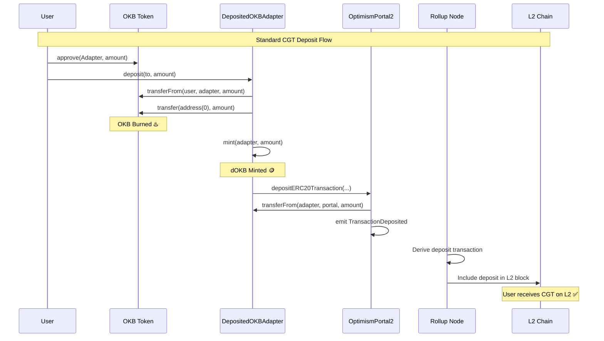
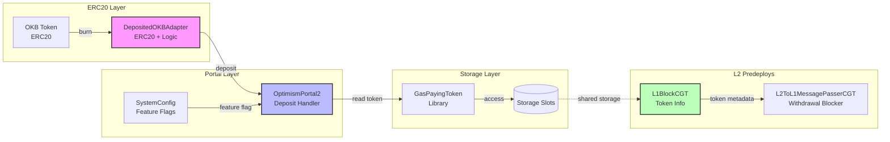
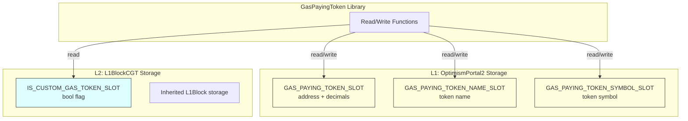
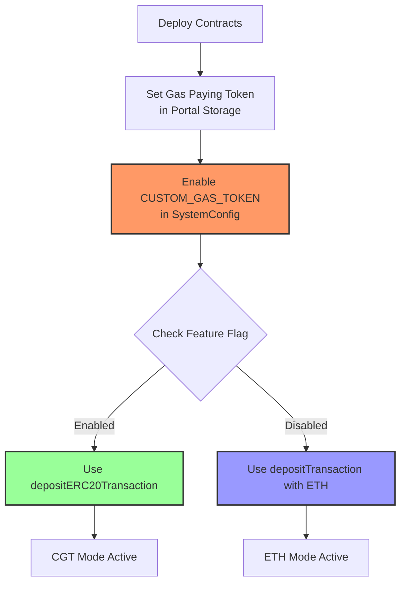
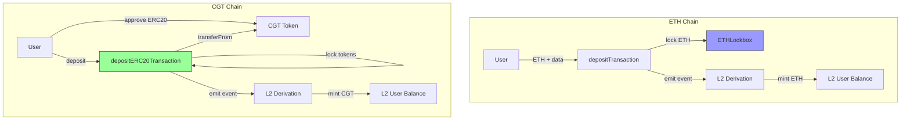

# Custom Gas Token Architecture Diagram

## System Architecture

```mermaid
graph TB
    subgraph "L1 - Ethereum"
        User[User]
        OKB[OKB Token Contract]
        Adapter[DepositedOKBAdapter]
        Portal[OptimismPortal2]
        SystemConfig[SystemConfig]

        User -->|1. Approve OKB| OKB
        User -->|2. deposit| Adapter
        Adapter -->|3. transferFrom| OKB
        Adapter -->|4. burn to address(0)| OKB
        Adapter -->|5. mint dOKB| Adapter
        Adapter -->|6. depositERC20Transaction| Portal
        Portal -->|7. transferFrom dOKB| Adapter
        Portal -->|8. emit TransactionDeposited| Portal
        SystemConfig -->|Feature Flag| Portal
    end

    subgraph "L2 - Optimism"
        Derivation[Rollup Node Derivation]
        L1Block[L1BlockCGT]
        L2ToL1[L2ToL1MessagePasserCGT]
        UserL2[User L2 Address]

        Portal -.->|9. Event Log| Derivation
        Derivation -->|10. Derive Deposit Tx| UserL2
        UserL2 -->|11. Use CGT| L2ToL1
        L1Block -->|Token Name/Symbol| UserL2
    end

    style Adapter fill:#f9f,stroke:#333,stroke-width:4px
    style Portal fill:#bbf,stroke:#333,stroke-width:4px
    style L1Block fill:#bfb,stroke:#333,stroke-width:4px
```

## Deposit Flow Sequence



## Contract Interaction Map



## Storage Layout



## Feature Flag Flow



## Comparison: ETH vs CGT Chains



## Token Flow: Burn and Mint

```mermaid
graph LR
    subgraph "L1 Supply"
        L1_Before[21M OKB Total]
        L1_Burn[OKB Burned<br/>to address 0]
        L1_After[<21M OKB Remaining]
        L1_dOKB[dOKB Minted<br/>locked in Adapter]
    end

    subgraph "Bridge"
        Bridge[OptimismPortal2<br/>Lock & Emit]
    end

    subgraph "L2 Supply"
        L2_Mint[CGT Minted on L2]
        L2_User[User Balance]
    end

    L1_Before --> L1_Burn
    L1_Burn --> L1_After
    L1_Burn -.-> L1_dOKB
    L1_dOKB --> Bridge
    Bridge -.-> L2_Mint
    L2_Mint --> L2_User

    style L1_Burn fill:#f99,stroke:#333,stroke-width:2px
    style L1_dOKB fill:#f9f,stroke:#333,stroke-width:2px
    style L2_Mint fill:#9f9,stroke:#333,stroke-width:2px
```

## Key Design Principles

### 1. **Separation of Concerns**
- **Adapter Layer**: Handles token-specific logic (OKB burning)
- **Portal Layer**: Generic deposit mechanism for any CGT
- **L2 Layer**: Token metadata and withdrawal restrictions

### 2. **Lock and Mint Pattern**
- L1: Lock tokens in Portal (or burn via Adapter)
- L2: Mint equivalent tokens to user
- Maintains 1:1 supply between L1 and L2

### 3. **Backward Compatibility**
- ETH chains continue using `depositTransaction`
- CGT chains use `depositERC20Transaction`
- Feature flag controls behavior

### 4. **Security Through Restriction**
- DepositedOKBAdapter: Limited transfers
- Portal: Feature flag checks
- L2ToL1MessagePasserCGT: Value restrictions

### 5. **Generic Infrastructure**
- Same Portal code for all CGT chains
- Token-specific adapters (like DepositedOKBAdapter)
- Shared storage patterns via GasPayingToken library
