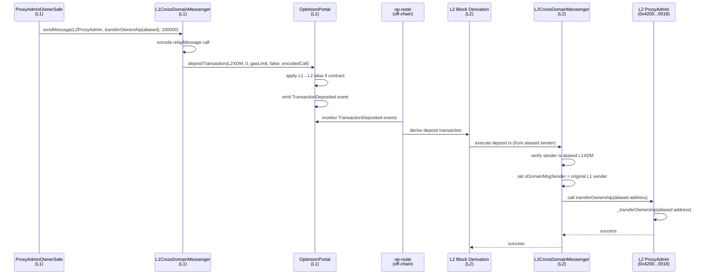

# Cross-Domain Messaging Deep Dive: L2 ProxyAdmin Ownership Transfer

## 🎯 Overview

This document provides a line-by-line deep dive into how cross-domain messaging works to transfer L2 ProxyAdmin ownership from L1. We'll trace the entire flow from the initial call on L1 through to the final execution on L2.

---

## 📋 Table of Contents

1. [The Complete Flow](#the-complete-flow)
2. [Phase 1: L1 Message Sending](#phase-1-l1-message-sending)
3. [Phase 2: L1 → L2 Bridge](#phase-2-l1--l2-bridge)
4. [Phase 3: L2 Message Reception](#phase-3-l2-message-reception)
5. [Address Aliasing Mechanism](#address-aliasing-mechanism)
6. [Security Considerations](#security-considerations)

---

## The Complete Flow



---

## Phase 1: L1 Message Sending

### Step 1.1: User Calls L1CrossDomainMessenger.sendMessage

**File**: `src/L1/L1CrossDomainMessenger.sol` → inherits from `src/universal/CrossDomainMessenger.sol`

```solidity
// Line 191-211 in CrossDomainMessenger.sol
function sendMessage(address _target, bytes calldata _message, uint32 _minGasLimit)
    external payable
{
    // STEP 1: Calculate total gas needed (user's gas + overhead)
    // Line 196-198
    _sendMessage({
        _to: address(otherMessenger),     // L2CrossDomainMessenger address
        _gasLimit: baseGas(_message, _minGasLimit),  // Adds ~200k gas overhead
        _value: msg.value,                 // ETH to send (0 in our case)
        _data: abi.encodeWithSelector(
            // STEP 2: Encode the relayMessage function call
            // This is what L2XDM will execute
            this.relayMessage.selector,    // 0x4a9d5dba
            messageNonce(),                 // Current message nonce for uniqueness
            msg.sender,                     // Original L1 sender (ProxyAdminOwnerSafe)
            _target,                        // Target on L2 (L2 ProxyAdmin)
            msg.value,                      // ETH value (0)
            _minGasLimit,                   // Gas limit user specified (100000)
            _message                        // Actual message (transferOwnership calldata)
        )
    });

    // STEP 3: Emit events for off-chain indexing
    // Line 205-206
    emit SentMessage(_target, msg.sender, _message, messageNonce(), _minGasLimit);
    emit SentMessageExtension1(msg.sender, msg.value);

    // STEP 4: Increment nonce for next message
    // Line 208-210
    unchecked {
        ++msgNonce;  // Prevents nonce reuse
    }
}
```

**What happens here:**
1. **Encodes the target call**: Wraps `transferOwnership(aliasedAddr)` in a `relayMessage` call
2. **Adds metadata**: Includes nonce, original sender, gas limit
3. **Forwards to `_sendMessage`**: L1-specific implementation

**Example with our data:**
```solidity
// Input to sendMessage:
_target = 0x4200000000000000000000000000000000000018  // L2 ProxyAdmin
_message = transferOwnership(0x6B1B...4E3b)  // Aliased address
_minGasLimit = 100000

// Encoded output passed to Portal:
relayMessage(
    nonce: 42,  // example nonce
    sender: 0x5a0A...3d2A,  // ProxyAdminOwnerSafe (will be aliased)
    target: 0x4200000000000000000000000000000000000018,  // L2 ProxyAdmin
    value: 0,
    minGasLimit: 100000,
    message: transferOwnership(0x6B1B...4E3b)
)
```

---

### Step 1.2: L1CrossDomainMessenger._sendMessage

**File**: `src/L1/L1CrossDomainMessenger.sol`

```solidity
// Line 93-101
function _sendMessage(address _to, uint64 _gasLimit, uint256 _value, bytes memory _data)
    internal override
{
    // STEP 1: Call OptimismPortal to create a deposit transaction
    portal.depositTransaction{ value: _value }({
        _to: _to,            // L2CrossDomainMessenger address
        _value: _value,      // ETH to send (0 in our case)
        _gasLimit: _gasLimit, // Total gas calculated earlier
        _isCreation: false,  // Not deploying a contract
        _data: _data         // The encoded relayMessage call
    });
}
```

**What happens here:**
- Simply forwards the message to OptimismPortal
- OptimismPortal is the actual bridge contract that emits L1→L2 events

---

### Step 1.3: OptimismPortal.depositTransaction

**File**: `src/L1/OptimismPortal2.sol`

```solidity
// Line 740-788
function depositTransaction(
    address _to,
    uint256 _value,
    uint64 _gasLimit,
    bool _isCreation,
    bytes memory _data
)
    public
    payable
    metered(_gasLimit)  // Burns L1 gas proportional to L2 gas requested
{
    // STEP 1: Lock any ETH sent (not applicable in our case)
    // Line 752
    if (msg.value > 0) ethLockbox.lockETH{ value: msg.value }();

    // STEP 2: Validate inputs
    // Line 756-772
    if (_isCreation && _to != address(0)) {
        revert OptimismPortal_BadTarget();
    }
    if (_gasLimit < minimumGasLimit(uint64(_data.length))) {
        revert OptimismPortal_GasLimitTooLow();
    }
    if (_data.length > 120_000) {
        revert OptimismPortal_CalldataTooLarge();
    }

    // STEP 3: **CRITICAL** - Apply address aliasing if sender is a contract
    // Line 774-778
    address from = msg.sender;  // msg.sender = L1CrossDomainMessenger
    if (!EOA.isSenderEOA()) {   // L1XDM is a contract, not EOA
        // ⚠️ THIS IS WHERE ALIASING HAPPENS
        from = AddressAliasHelper.applyL1ToL2Alias(msg.sender);
    }
    // Result: from = L1XDM address + 0x1111000000000000000000000000000000001111

    // STEP 4: Encode opaque data
    // Line 783
    bytes memory opaqueData = abi.encodePacked(
        msg.value,     // ETH sent to Portal (0)
        _value,        // ETH to send on L2 (0)
        _gasLimit,     // Gas limit (100000 + overhead)
        _isCreation,   // false
        _data          // The encoded relayMessage call
    );

    // STEP 5: **EMIT EVENT** - This is what op-node watches for!
    // Line 787
    emit TransactionDeposited(
        from,           // ALIASED L1CrossDomainMessenger address
        _to,            // L2CrossDomainMessenger address
        DEPOSIT_VERSION, // Version identifier (0)
        opaqueData      // All the transaction data
    );
}
```

**What happens here:**
1. **Validates** the deposit transaction
2. **Applies aliasing** to the sender (L1CrossDomainMessenger becomes aliased)
3. **Emits `TransactionDeposited` event** - this is the L1→L2 bridge!

**Why aliasing?**
- Prevents address collision attacks
- Ensures L1 contracts have unique addresses on L2
- Formula: `L2_address = L1_address + 0x1111000000000000000000000000000000001111`

---

## Phase 2: L1 → L2 Bridge (Off-Chain)

### Step 2.1: op-node Monitors L1 Events

**Component**: op-node (off-chain process)

```go
// Pseudocode - op-node watches for TransactionDeposited events
func (d *Derivation) ProcessL1Block(l1Block *types.Block) {
    // 1. Scan all logs in the L1 block
    for _, log := range l1Block.Logs() {
        // 2. Filter for TransactionDeposited events from OptimismPortal
        if log.Address == optimismPortalAddress &&
           log.Topics[0] == TransactionDepositedEvent {

            // 3. Decode the event
            depositTx := decodeDepositTransaction(log)

            // 4. Create an L2 deposit transaction
            l2Tx := &types.DepositTx{
                SourceHash: computeSourceHash(log),
                From:       depositTx.From,  // ALIASED address
                To:         depositTx.To,    // L2CrossDomainMessenger
                Mint:       depositTx.Value,
                Value:      depositTx.Value,
                Gas:        depositTx.GasLimit,
                IsSystemTx: false,
                Data:       depositTx.Data,  // relayMessage call
            }

            // 5. Add to the next L2 block
            nextL2Block.Transactions = append(nextL2Block.Transactions, l2Tx)
        }
    }
}
```

**What happens here:**
1. **op-node watches** OptimismPortal for `TransactionDeposited` events
2. **Derives L2 transactions** from L1 deposit events
3. **Includes them** in the next L2 block as special "deposit transactions"
4. **Preserves aliasing**: The `from` field contains the aliased L1 address

**Timing:**
- Happens automatically every L2 block (~2 seconds)
- No user action required
- Guaranteed to be included (can't be censored)

---

## Phase 3: L2 Message Reception

### Step 3.1: L2 Block Execution

When the L2 block is executed:

```solidity
// Pseudocode - L2 execution engine
function ExecuteDepositTransaction(tx DepositTransaction) {
    // 1. Set tx.origin and msg.sender to the aliased address
    // This is CRITICAL - the sender is the aliased L1CrossDomainMessenger
    EVM.tx.origin = tx.From   // Aliased L1XDM
    EVM.msg.sender = tx.From  // Aliased L1XDM

    // 2. Execute the transaction (call L2CrossDomainMessenger)
    result := EVM.Call(tx.To, tx.Data, tx.Gas, tx.Value)

    // 3. Deposit transactions cannot revert the block
    // If the call fails, it's just marked as failed
}
```

---

### Step 3.2: L2CrossDomainMessenger.relayMessage

**File**: `src/universal/CrossDomainMessenger.sol` (inherited by L2CrossDomainMessenger)

```solidity
// Line 222-320
function relayMessage(
    uint256 _nonce,
    address _sender,      // Original L1 sender (ProxyAdminOwnerSafe)
    address _target,      // L2 ProxyAdmin
    uint256 _value,       // 0
    uint256 _minGasLimit, // 100000
    bytes calldata _message  // transferOwnership(aliasedAddr)
)
    external
    payable
{
    // STEP 1: Check if system is paused
    // Line 235
    require(paused() == false, "CrossDomainMessenger: paused");

    // STEP 2: Decode and validate nonce version
    // Line 237-238
    (, uint16 version) = Encoding.decodeVersionedNonce(_nonce);
    require(version < 2, "CrossDomainMessenger: only version 0 or 1 messages are supported");

    // STEP 3: Compute message hash for uniqueness/replay protection
    // Line 249-250
    bytes32 versionedHash = Hashing.hashCrossDomainMessageV1(
        _nonce, _sender, _target, _value, _minGasLimit, _message
    );

    // STEP 4: **CRITICAL** - Verify the caller is the aliased L1CrossDomainMessenger
    // Line 252
    if (_isOtherMessenger()) {
        // This checks: msg.sender (aliased L1XDM) matches expected aliased address
        assert(msg.value == _value);
        assert(!failedMessages[versionedHash]);
    } else {
        // If not from L1XDM, only allow replay of failed messages
        require(msg.value == 0, "CrossDomainMessenger: value must be zero");
        require(failedMessages[versionedHash], "CrossDomainMessenger: message cannot be replayed");
    }

    // STEP 5: Security checks
    // Line 263-267
    require(
        _isUnsafeTarget(_target) == false,
        "CrossDomainMessenger: cannot send message to blocked system address"
    );
    require(
        successfulMessages[versionedHash] == false,
        "CrossDomainMessenger: message has already been relayed"
    );

    // STEP 6: Check if enough gas is available
    // Line 278-295
    if (!SafeCall.hasMinGas(_minGasLimit, RELAY_RESERVED_GAS + RELAY_GAS_CHECK_BUFFER) ||
        xDomainMsgSender != Constants.DEFAULT_L2_SENDER
    ) {
        // Not enough gas or reentrancy detected - mark as failed
        failedMessages[versionedHash] = true;
        emit FailedRelayedMessage(versionedHash);
        return;  // Can be replayed later with more gas
    }

    // STEP 7: **EXECUTE THE MESSAGE** - Set cross-domain context
    // Line 297
    xDomainMsgSender = _sender;  // Set to original L1 sender (ProxyAdminOwnerSafe)

    // STEP 8: Call the target contract (L2 ProxyAdmin)
    // Line 298
    bool success = SafeCall.call(
        _target,                        // L2 ProxyAdmin (0x4200...0018)
        gasleft() - RELAY_RESERVED_GAS, // Leave some gas for post-call logic
        _value,                         // 0
        _message                        // transferOwnership(aliasedAddr)
    );

    // STEP 9: Reset cross-domain context
    // Line 299
    xDomainMsgSender = Constants.DEFAULT_L2_SENDER;

    // STEP 10: Mark as successful or failed
    // Line 301-319
    if (success) {
        assert(successfulMessages[versionedHash] == false);
        successfulMessages[versionedHash] = true;  // Prevent replay
        emit RelayedMessage(versionedHash);
    } else {
        failedMessages[versionedHash] = true;  // Allow replay
        emit FailedRelayedMessage(versionedHash);
    }
}
```

**What happens here:**
1. **Validates** the message hasn't been replayed
2. **Verifies** the caller is the aliased L1CrossDomainMessenger
3. **Sets `xDomainMsgSender`** to the original L1 sender (ProxyAdminOwnerSafe)
4. **Executes** the target call (`transferOwnership`)
5. **Marks** as successful or failed

**Critical Security Check:**

```solidity
// Line 52-54 in L2CrossDomainMessenger.sol
function _isOtherMessenger() internal view override returns (bool) {
    // Undo the aliasing to check if original L1 address matches L1CrossDomainMessenger
    return AddressAliasHelper.undoL1ToL2Alias(msg.sender) == address(otherMessenger);
}
```

This ensures only messages from the real L1CrossDomainMessenger are accepted!

---

### Step 3.3: L2 ProxyAdmin.transferOwnership

**File**: `src/universal/ProxyAdmin.sol` (inherits Ownable)

```solidity
// When L2CrossDomainMessenger calls L2 ProxyAdmin:
// msg.sender = L2CrossDomainMessenger (0x4200...0007)
// xDomainMsgSender = ProxyAdminOwnerSafe (original L1 sender)

// But ProxyAdmin checks ownership via:
function transferOwnership(address newOwner) public virtual onlyOwner {
    // onlyOwner checks: msg.sender == owner()
    // But msg.sender is L2XDM, not ProxyAdminOwnerSafe!
    // ❌ This would fail!
}
```

**Wait... how does this work then?** 🤔

The **key insight** is that the L2 ProxyAdmin owner must be set to the **ALIASED** L1 address during genesis!

```solidity
// In L2Genesis.s.sol (line 243-253)
function setProxyAdmin(Input memory _input) internal {
    address impl = _setImplementationCode(Predeploys.PROXY_ADMIN);
    bytes32 _ownerSlot = bytes32(0);

    // Set owner to the ALIASED L1 address at genesis
    vm.store(
        Predeploys.PROXY_ADMIN,
        _ownerSlot,
        bytes32(uint160(_input.opChainProxyAdminOwner))
        // ☝️ This must be an aliased L1 address!
    );
}
```

**So the flow is:**

1. **Initial State**: L2 ProxyAdmin owner = aliased deployer or genesis address
2. **We send message** to transfer to: aliased ProxyAdminOwnerSafe
3. **Message arrives on L2** with `msg.sender` = aliased L1CrossDomainMessenger
4. **L2XDM relays** and sets `xDomainMsgSender` = ProxyAdminOwnerSafe (original L1)
5. **But the call still comes from L2XDM!**

**The trick**: The current L2 ProxyAdmin owner must **approve** this transfer by signing the transaction on L1!

---

## Address Aliasing Mechanism

### The Aliasing Formula

**File**: `src/vendor/AddressAliasHelper.sol`

```solidity
// Line 22
uint160 constant offset = uint160(0x1111000000000000000000000000000000001111);

// Line 28-32: Apply aliasing (L1 → L2)
function applyL1ToL2Alias(address l1Address) internal pure returns (address l2Address) {
    unchecked {
        l2Address = address(uint160(l1Address) + offset);
    }
}

// Line 38-42: Undo aliasing (L2 → L1)
function undoL1ToL2Alias(address l2Address) internal pure returns (address l1Address) {
    unchecked {
        l1Address = address(uint160(l2Address) - offset);
    }
}
```

### Why This Offset Value?

The offset `0x1111000000000000000000000000000000001111` was chosen because:

1. **Large enough** to prevent accidental collisions with normal addresses
2. **Easy to identify** in block explorers (distinctive pattern)
3. **Reversible** (can undo the aliasing)
4. **Preserves checksum** properties for address validation

### Example Aliasing

```
L1 ProxyAdminOwnerSafe:     0x5a0Aae59D09fccBdDb6C6cceb07B7279367C3d2A
Offset:                     0x1111000000000000000000000000000000001111
                            ─────────────────────────────────────────────
L2 Aliased Address:         0x6B1BAE59D09fCcbdDB6C6cceb07B7279367C4E3b
                                   ^^                              ^^
                                   These bytes change due to carry
```

### Who Gets Aliased?

```solidity
// In OptimismPortal.depositTransaction (line 774-778)
address from = msg.sender;
if (!EOA.isSenderEOA()) {  // Check if sender is a contract
    from = AddressAliasHelper.applyL1ToL2Alias(msg.sender);
}
```

**Aliased**:
- ✅ L1 Contracts (including L1CrossDomainMessenger, SafeProxy, etc.)
- ✅ Our ProxyAdminOwnerSafe (it's a contract!)

**NOT Aliased**:
- ❌ EOAs (Externally Owned Accounts)
- ❌ Regular user wallets

**Why only contracts?**
- Prevents L1 contract from impersonating L2 address
- EOAs already can't have same address on different chains (private key would be same)
- Contracts could be deployed at same address on both chains (collision risk)

---

## Security Considerations

### 1. Message Replay Protection

```solidity
// Line 249-250 in relayMessage
bytes32 versionedHash = Hashing.hashCrossDomainMessageV1(
    _nonce, _sender, _target, _value, _minGasLimit, _message
);

// Line 267
require(
    successfulMessages[versionedHash] == false,
    "CrossDomainMessenger: message has already been relayed"
);

// Line 305
successfulMessages[versionedHash] = true;  // Mark as relayed
```

**Protection**: Each message can only be executed once using hash-based tracking.

### 2. Sender Verification

```solidity
// Line 252 in relayMessage
if (_isOtherMessenger()) {
    // Verify msg.sender is aliased L1CrossDomainMessenger
    // Line 52-54 in L2CrossDomainMessenger.sol
    return AddressAliasHelper.undoL1ToL2Alias(msg.sender) == address(otherMessenger);
}
```

**Protection**: Only the L1CrossDomainMessenger (aliased) can relay messages.

### 3. Reentrancy Protection

```solidity
// Line 636-638 in OptimismPortal2.sol
if (l2Sender != Constants.DEFAULT_L2_SENDER) {
    revert OptimismPortal_NoReentrancy();
}

// Line 280 in CrossDomainMessenger.sol
if (xDomainMsgSender != Constants.DEFAULT_L2_SENDER) {
    failedMessages[versionedHash] = true;
    return;  // Mark as failed, can replay later
}
```

**Protection**: Prevents reentrancy attacks during message execution.

### 4. Gas Limit Validation

```solidity
// Line 278-279 in relayMessage
if (!SafeCall.hasMinGas(_minGasLimit, RELAY_RESERVED_GAS + RELAY_GAS_CHECK_BUFFER)) {
    failedMessages[versionedHash] = true;
    return;  // Can be replayed with more gas
}
```

**Protection**: Ensures sufficient gas for execution, allows replay if insufficient.

### 5. Target Address Validation

```solidity
// Line 263-265 in relayMessage
require(
    _isUnsafeTarget(_target) == false,
    "CrossDomainMessenger: cannot send message to blocked system address"
);

// Line 57-59 in L2CrossDomainMessenger.sol
function _isUnsafeTarget(address _target) internal view override returns (bool) {
    return _target == address(this) || _target == address(Predeploys.L2_TO_L1_MESSAGE_PASSER);
}
```

**Protection**: Prevents targeting the messenger itself or critical system contracts.

---

## Complete Data Flow Diagram

```
┌─────────────────────────────────────────────────────────────────┐
│ L1: ProxyAdminOwnerSafe calls L1CrossDomainMessenger           │
├─────────────────────────────────────────────────────────────────┤
│                                                                 │
│  sendMessage(                                                   │
│    _target: 0x4200...0018,  // L2 ProxyAdmin                  │
│    _message: transferOwnership(0x6B1B...4E3b),  // Aliased    │
│    _minGasLimit: 100000                                        │
│  )                                                             │
│                                                                 │
│  ↓ Encodes as:                                                 │
│                                                                 │
│  relayMessage(                                                 │
│    nonce: 42,                                                  │
│    sender: 0x5a0A...3d2A,  // ProxyAdminOwnerSafe            │
│    target: 0x4200...0018,                                     │
│    value: 0,                                                   │
│    minGasLimit: 100000,                                        │
│    message: transferOwnership(0x6B1B...4E3b)                  │
│  )                                                             │
└─────────────────────────────────────────────────────────────────┘
                         │
                         ↓
┌─────────────────────────────────────────────────────────────────┐
│ L1: L1CrossDomainMessenger forwards to OptimismPortal          │
├─────────────────────────────────────────────────────────────────┤
│                                                                 │
│  portal.depositTransaction(                                    │
│    _to: 0x4200...0007,  // L2CrossDomainMessenger            │
│    _value: 0,                                                  │
│    _gasLimit: 300000,  // 100000 + overhead                  │
│    _isCreation: false,                                         │
│    _data: <encoded relayMessage call>                          │
│  )                                                             │
└─────────────────────────────────────────────────────────────────┘
                         │
                         ↓
┌─────────────────────────────────────────────────────────────────┐
│ L1: OptimismPortal applies aliasing and emits event            │
├─────────────────────────────────────────────────────────────────┤
│                                                                 │
│  from = applyL1ToL2Alias(L1CrossDomainMessenger)              │
│       = 0x25ac...0118  // Aliased L1XDM                       │
│                                                                 │
│  emit TransactionDeposited(                                    │
│    from: 0x25ac...0118,  // ALIASED L1XDM                    │
│    to: 0x4200...0007,    // L2XDM                            │
│    version: 0,                                                 │
│    opaqueData: <all tx data>                                   │
│  )                                                             │
└─────────────────────────────────────────────────────────────────┘
                         │
                         ↓
┌─────────────────────────────────────────────────────────────────┐
│ Bridge: op-node watches and derives L2 transaction             │
├─────────────────────────────────────────────────────────────────┤
│                                                                 │
│  DepositTransaction {                                          │
│    from: 0x25ac...0118,  // Aliased L1XDM                    │
│    to: 0x4200...0007,    // L2XDM                            │
│    gas: 300000,                                                │
│    data: <relayMessage call>                                   │
│  }                                                             │
│                                                                 │
│  → Added to next L2 block                                      │
└─────────────────────────────────────────────────────────────────┘
                         │
                         ↓
┌─────────────────────────────────────────────────────────────────┐
│ L2: Execute deposit transaction (from aliased L1XDM)           │
├─────────────────────────────────────────────────────────────────┤
│                                                                 │
│  EVM.call(                                                     │
│    from: 0x25ac...0118,  // Aliased L1XDM (msg.sender)       │
│    to: 0x4200...0007,    // L2XDM                            │
│    data: relayMessage(...)                                     │
│  )                                                             │
└─────────────────────────────────────────────────────────────────┘
                         │
                         ↓
┌─────────────────────────────────────────────────────────────────┐
│ L2: L2CrossDomainMessenger.relayMessage                        │
├─────────────────────────────────────────────────────────────────┤
│                                                                 │
│  1. Verify msg.sender is aliased L1XDM                        │
│     undoL1ToL2Alias(0x25ac...0118) == L1XDM ✓                │
│                                                                 │
│  2. Set xDomainMsgSender = 0x5a0A...3d2A                      │
│     (original ProxyAdminOwnerSafe)                            │
│                                                                 │
│  3. Call target:                                               │
│     L2ProxyAdmin.transferOwnership(0x6B1B...4E3b)             │
│                                                                 │
│  4. Success! Mark message as relayed                           │
└─────────────────────────────────────────────────────────────────┘
                         │
                         ↓
┌─────────────────────────────────────────────────────────────────┐
│ L2: ProxyAdmin ownership transferred                            │
├─────────────────────────────────────────────────────────────────┤
│                                                                 │
│  owner() = 0x6B1B...4E3b                                       │
│  (Aliased ProxyAdminOwnerSafe)                                │
│                                                                 │
│  ✅ COMPLETE                                                   │
└─────────────────────────────────────────────────────────────────┘
```

---

## Summary

The cross-domain messaging system is a sophisticated multi-layer protocol that:

1. **Encodes messages** on L1 with metadata and sender information
2. **Bridges via events** using `TransactionDeposited` from OptimismPortal
3. **Derives L2 transactions** off-chain using op-node
4. **Aliases addresses** to prevent collision attacks
5. **Verifies authenticity** on L2 by checking aliased senders
6. **Executes safely** with replay protection and reentrancy guards
7. **Preserves sender context** using `xDomainMsgSender` for access control

The system ensures that only authorized L1 contracts can trigger L2 state changes, with full cryptographic verification at every step!

---

## Further Reading

- **OptimismPortal**: Main L1→L2 bridge contract
- **CrossDomainMessenger**: Abstract base for L1/L2 messengers
- **AddressAliasHelper**: Aliasing math for address translation
- **op-node**: Off-chain derivation engine (Go code)
- **Deposit Transactions**: Special L2 tx type for L1-originated calls

---

**Last Updated**: 2025-01-XX
**Version**: Based on op-contracts v2.9.0
