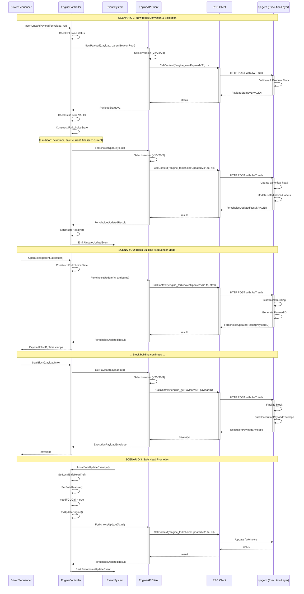

# Engine API Entry Points - FCU, NewPayload, and GetPayload

This document identifies the entry points and facades for the three core Engine API methods in the OP Stack.

## ⚠️ IMPORTANT: xlayer Hybrid Architecture

**This repository implements a HYBRID UNIFIED BINARY called `xlayer`:**

- **Consensus Layer**: [Kona](https://github.com/ethereum-optimism/kona) (Rust) - NOT op-node (Go)
- **Execution Layer**: op-reth (Rust) - NOT op-geth (Go)  
- **Communication**: MPSC/Rayon channels - NOT HTTP/JSON-RPC over JWT

### Architecture Comparison

| Component | Standard OP Stack | **xlayer (This Repo)** |
|-----------|------------------|----------------------|
| **Consensus Layer** | op-node (Go) | **Kona (Rust)** |
| **Execution Layer** | op-geth (Go) | **op-reth (Rust)** |
| **Communication** | HTTP JSON-RPC (Port 8551, JWT) | **MPSC/Rayon channels (in-process)** |
| **Language** | Go + Go | **Rust + Rust** |
| **Deployment** | Two separate processes | **Single unified binary** |

### Key Differences

1. **In-Process Communication**: Instead of network RPC calls, xlayer uses Tokio MPSC channels for inter-layer communication
2. **Rust Implementation**: Both layers are implemented in Rust, allowing better integration and performance
3. **Unified Binary**: Single executable that runs both consensus and execution layers
4. **Channel-based Engine API**: Engine API calls use message passing instead of HTTP requests

---

## Engine API Methods:
- **ForkchoiceUpdated (FCU)** - Updates the forkchoice state on the execution client
- **NewPayload** - Executes a full block on the execution engine
- **GetPayload** - Retrieves the execution payload associated with a PayloadID

---

## Document Organization

This document covers **THREE architectures**:

1. **Standard OP Stack** (op-node + op-geth) - For reference and comparison
2. **xlayer Architecture** (Kona + op-reth) - The actual implementation in this repository
3. **Hybrid Diagrams** - Showing both architectures

---

## Table of Contents

### Part 0: xlayer Hybrid Architecture (Kona + op-reth)
**THE ACTUAL IMPLEMENTATION IN THIS REPOSITORY**

- [XL-1. xlayer Architecture Overview](#xl-1-xlayer-architecture-overview)
- [XL-2. Kona Consensus Layer (Rust)](#xl-2-kona-consensus-layer-rust)
- [XL-3. op-reth Execution Layer (Rust)](#xl-3-op-reth-execution-layer-rust)
- [XL-4. MPSC Channel Communication](#xl-4-mpsc-channel-communication)
- [XL-5. Key Differences from Standard OP Stack](#xl-5-key-differences-from-standard-op-stack)

### Part 1: Consensus Layer (op-node) - CLIENT Perspective
**REFERENCE IMPLEMENTATION (Standard OP Stack with Go)**

The consensus layer **makes** Engine API calls to control the execution layer.

- [CL-1. Main Facade Layer: EngineAPIClient](#cl-1-main-facade-layer-engineapiclient)
- [CL-2. Controller Layer: EngineController](#cl-2-controller-layer-enginecontroller)
- [CL-3. RPC API Layer](#cl-3-rpc-api-layer-engine-controller-api)
- [CL-4. Event-Driven Entry Points](#cl-4-event-driven-entry-points)
- [CL-5. Supporting Components](#cl-5-supporting-components)
- [CL-6. Call Flow Summary (Consensus)](#cl-6-call-flow-summary-consensus-layer)
- [CL-7. Key Files Reference (Consensus)](#cl-7-key-files-reference-consensus-layer)

### Part 2: Execution Layer (op-geth) - SERVER Perspective
**REFERENCE IMPLEMENTATION (Standard OP Stack with Go)**

The execution layer **implements** Engine API methods and responds to consensus layer requests.

- [EL-1. Engine API Server Implementation](#el-1-engine-api-server-implementation)
- [EL-2. Block Building Pipeline](#el-2-block-building-pipeline)
- [EL-3. State Management](#el-3-state-management)
- [EL-4. OP Stack Specific Modifications](#el-4-op-stack-specific-modifications)
- [EL-5. RPC Server Setup](#el-5-rpc-server-setup)
- [EL-6. Validation Pipeline](#el-6-validation-pipeline)
- [EL-7. Key Files Reference (Execution)](#el-7-key-files-reference-execution-layer)
- [EL-8. Call Flow Summary (Execution)](#el-8-call-flow-summary-execution-layer)
- [EL-9. Reference Implementation](#el-9-reference-implementation)

### Part 3: Sequence Diagrams - Complete Flows
Detailed sequence diagrams showing end-to-end interactions for BOTH architectures.

- [SD-1. Consensus Layer Perspective - Complete Flow](#sd-1-consensus-layer-perspective---complete-flow) *(Standard OP Stack)*
- [SD-2. Execution Layer Perspective - Complete Flow](#sd-2-execution-layer-perspective---complete-flow) *(Standard OP Stack)*
- [SD-3. Complete End-to-End Flow - Both Layers](#sd-3-complete-end-to-end-flow---both-layers) *(Standard OP Stack)*
- [SD-4. Error Handling & Recovery Flows](#sd-4-error-handling--recovery-flows) *(Standard OP Stack)*
- [SD-5. xlayer End-to-End Flow - Kona + op-reth](#sd-5-xlayer-end-to-end-flow---kona--op-reth) *(xlayer Implementation)*

### [Conclusion - Full Architecture](#conclusion---full-architecture)

---

## PART 0: xlayer HYBRID ARCHITECTURE (Kona + op-reth)

**🎯 THIS IS THE ACTUAL IMPLEMENTATION IN THIS REPOSITORY**

---

## XL-1. xlayer Architecture Overview

**Location**: `rust/kona/` and `rust/op-reth/`

### Unified Binary Architecture

xlayer combines Kona (consensus layer) and op-reth (execution layer) into a single Rust binary that communicates via in-process channels instead of network RPC.

```
┌─────────────────────────────────────────────────────────┐
│                xlayer Unified Binary                     │
│                                                          │
│  ┌────────────────────────┐  ┌─────────────────────┐   │
│  │  Kona (Consensus)      │  │  op-reth (Execution) │   │
│  │  ==================     │  │  ==================  │   │
│  │  - Derivation Pipeline │  │  - Block Validation  │   │
│  │  - Block Building      │  │  - EVM Execution    │   │
│  │  - Engine Controller   │  │  - State Management │   │
│  │  - L1 Data Fetching   │  │  - Transaction Pool  │   │
│  └─────────┬──────────────┘  └──────┬──────────────┘   │
│            │                         │                   │
│            │    MPSC Channels       │                   │
│            │◄──────────────────────►│                   │
│            │    (Tokio/Rayon)       │                   │
│            │                         │                   │
└────────────┼─────────────────────────┼───────────────────┘
             │                         │
             ▼                         ▼
        L1 RPC Client            Database (RocksDB/MDBX)
```

### Key Characteristics

1. **Single Process**: Both layers run in the same process
2. **Shared Memory**: Direct memory access between components
3. **Zero Network Overhead**: No HTTP/JSON-RPC serialization
4. **Type-Safe Communication**: Rust type system enforces correctness
5. **Channel-Based**: Uses `tokio::sync::mpsc` and `rayon` for inter-layer communication

---

## XL-2. Kona Consensus Layer (Rust)

**Location**: `rust/kona/crates/node/`

Kona is the Rust implementation of the OP Stack consensus layer (equivalent to op-node but in Rust).

### Main Components

#### XL-2.1. Engine Request Processor

**Location**: `rust/kona/crates/node/service/src/actors/engine/engine_request_processor.rs`

This is the **main orchestrator** analogous to `EngineController` in op-node.

```rust
pub struct EngineProcessor<EngineClient_, DerivationClient> {
    derivation_client: DerivationClient,
    el_sync_complete: bool,
    last_safe_head_sent: L2BlockInfo,
    unsafe_head_tx: Option<watch::Sender<L2BlockInfo>>,
    rollup: Arc<RollupConfig>,
    client: Arc<EngineClient_>,
    engine: Engine<EngineClient_>,
}
```

**Key Responsibilities:**
- Manages Engine task queue
- Processes engine requests via MPSC channels
- Coordinates with derivation pipeline
- Sends Engine API "calls" via channels (not HTTP)

#### XL-2.2. Engine Processing Requests

**Location**: Same file, line ~28

```rust
pub enum EngineProcessingRequest {
    Build(Box<BuildRequest>),
    ProcessSafeL2Signal(ConsolidateInput),
    ProcessFinalizedL2BlockNumber(Box<u64>),
    ProcessUnsafeL2Block(Box<OpExecutionPayloadEnvelope>),
    Reset(Box<ResetRequest>),
    Seal(Box<SealRequest>),
}
```

These are sent over MPSC channels instead of HTTP POST requests.

#### XL-2.3. Engine Tasks

**Location**: `rust/kona/crates/node/engine/src/task_queue/tasks/`

Kona uses a task-based system for Engine operations:

- **BuildTask** - Equivalent to ForkchoiceUpdate with attributes
- **SealTask** - Equivalent to GetPayload
- **InsertTask** - Equivalent to NewPayload
- **ConsolidateTask** - Update safe head
- **FinalizeTask** - Update finalized head

#### XL-2.4. Engine Client Trait

**Location**: `rust/kona/crates/node/engine/src/test_utils/engine_client.rs`

```rust
pub trait EngineClient: Send + Sync {
    async fn fork_choice_updated(
        &self,
        state: ForkchoiceState,
        attributes: Option<PayloadAttributes>,
    ) -> Result<ForkchoiceUpdated, EngineClientError>;
    
    async fn new_payload(
        &self,
        payload: ExecutionPayload,
    ) -> Result<PayloadStatus, EngineClientError>;
    
    async fn get_payload(
        &self,
        id: PayloadId,
    ) -> Result<ExecutionPayloadEnvelope, EngineClientError>;
}
```

**Implementations:**
- **Channel-based**: Sends messages over MPSC to op-reth
- **RPC-based**: Can also use HTTP (for testing/compatibility)

### Kona Architecture

```
Derivation Pipeline
    ↓
EngineProcessor
    ↓
Engine Task Queue (Priority Queue)
    ↓
EngineClient (Channel Adapter)
    ↓
MPSC Channel
    ↓
op-reth Engine Handler
```

---

## XL-3. op-reth Execution Layer (Rust)

**Location**: `rust/op-reth/`

op-reth is the Rust implementation of the execution layer (equivalent to op-geth but in Rust).

### Main Components

#### XL-3.1. Engine API Implementation

**Location**: `rust/op-reth/crates/rpc/src/engine.rs`

```rust
#[rpc(server, namespace = "engine")]
pub trait OpEngineApi<Engine: EngineTypes> {
    #[method(name = "newPayloadV2")]
    async fn new_payload_v2(&self, payload: ExecutionPayloadInputV2) 
        -> RpcResult<PayloadStatus>;
    
    #[method(name = "newPayloadV3")]
    async fn new_payload_v3(
        &self,
        payload: ExecutionPayloadV3,
        versioned_hashes: Vec<B256>,
        parent_beacon_block_root: B256,
    ) -> RpcResult<PayloadStatus>;
    
    #[method(name = "newPayloadV4")]
    async fn new_payload_v4(
        &self,
        payload: OpExecutionPayloadV4,
        versioned_hashes: Vec<B256>,
        parent_beacon_block_root: B256,
        execution_requests: Requests,
    ) -> RpcResult<PayloadStatus>;
    
    #[method(name = "forkchoiceUpdatedV1")]
    async fn fork_choice_updated_v1(
        &self,
        fork_choice_state: ForkchoiceState,
        payload_attributes: Option<Engine::PayloadAttributes>,
    ) -> RpcResult<ForkchoiceUpdated>;
    
    #[method(name = "forkchoiceUpdatedV2")]
    async fn fork_choice_updated_v2(
        &self,
        fork_choice_state: ForkchoiceState,
        payload_attributes: Option<Engine::PayloadAttributes>,
    ) -> RpcResult<ForkchoiceUpdated>;
    
    #[method(name = "forkchoiceUpdatedV3")]
    async fn fork_choice_updated_v3(
        &self,
        fork_choice_state: ForkchoiceState,
        payload_attributes: Option<Engine::PayloadAttributes>,
    ) -> RpcResult<ForkchoiceUpdated>;
    
    #[method(name = "getPayloadV2")]
    async fn get_payload_v2(&self, payload_id: PayloadId) 
        -> RpcResult<ExecutionPayloadEnvelopeV2>;
        
    // ... V3, V4 etc.
}
```

**Note**: These can be called either via:
1. **HTTP JSON-RPC** (traditional way, for compatibility)
2. **Direct function calls via channels** (xlayer way, for performance)

#### XL-3.2. Engine Implementation

**Location**: `rust/op-reth/crates/node/src/engine.rs`

The actual execution logic:
- Block validation
- State execution
- Transaction processing
- Block building
- Payload management

---

## XL-4. MPSC Channel Communication

### Channel Setup

**Location**: `rust/kona/crates/node/service/src/actors/engine/actor.rs`

```rust
// Line 57-58
let (rpc_tx, rpc_rx) = mpsc::channel(1024);
let (engine_processing_tx, engine_processing_rx) = mpsc::channel(1024);
```

### Communication Flow

```rust
// Kona Side (Sender)
engine_processing_tx.send(EngineProcessingRequest::Build(request)).await?;

// op-reth Side (Receiver)
while let Some(request) = engine_processing_rx.recv().await {
    match request {
        EngineProcessingRequest::Build(req) => {
            // Call engine.fork_choice_updated internally
        }
        EngineProcessingRequest::ProcessUnsafeL2Block(envelope) => {
            // Call engine.new_payload internally
        }
        EngineProcessingRequest::Seal(req) => {
            // Call engine.get_payload internally
        }
        // ... other variants
    }
}
```

### Message Types

Instead of HTTP requests, xlayer uses these message types:

```rust
// NewPayload equivalent
EngineProcessingRequest::ProcessUnsafeL2Block(
    Box::new(OpExecutionPayloadEnvelope { /* ... */ })
)

// ForkchoiceUpdate equivalent (with attributes)
EngineProcessingRequest::Build(
    Box::new(BuildRequest {
        attributes: PayloadAttributes { /* ... */ },
        parent: BlockId,
    })
)

// GetPayload equivalent
EngineProcessingRequest::Seal(
    Box::new(SealRequest {
        payload_id: PayloadId,
    })
)
```

### Advantages of Channel Communication

1. **Performance**: No serialization/deserialization overhead
2. **Type Safety**: Compile-time type checking
3. **Zero Copy**: Can pass data by reference in same process
4. **Back Pressure**: Built-in flow control via channel capacity
5. **Async Native**: Seamlessly integrates with Tokio runtime

---

## XL-5. Key Differences from Standard OP Stack

### Comparison Table

| Aspect | Standard OP Stack<br/>(op-node + op-geth) | xlayer<br/>(Kona + op-reth) |
|--------|------------------------------------------|------------------------------|
| **Language** | Go + Go | Rust + Rust |
| **Deployment** | 2 separate binaries | 1 unified binary |
| **Communication** | HTTP JSON-RPC (Port 8551) | MPSC channels (in-process) |
| **Authentication** | JWT tokens | N/A (same process) |
| **Serialization** | JSON encoding/decoding | Direct struct passing |
| **Network** | TCP/HTTP stack | Memory channels |
| **Latency** | ~1-5ms per call | <0.1ms per call |
| **Type Safety** | Runtime (JSON validation) | Compile-time (Rust types) |
| **Error Handling** | HTTP status codes | Rust Result types |
| **Concurrency** | Goroutines | Tokio tasks |

### Code Location Mapping

| Component | Standard OP Stack | xlayer |
|-----------|------------------|--------|
| **Consensus Layer** | `op-node/` (Go) | `rust/kona/` (Rust) |
| **Engine Controller** | `op-node/rollup/engine/engine_controller.go` | `rust/kona/crates/node/service/src/actors/engine/engine_request_processor.rs` |
| **Engine API Client** | `op-service/sources/engine_client.go` | `rust/kona/crates/node/engine/src/` (various trait impls) |
| **Execution Layer** | `op-geth/` (separate repo, Go) | `rust/op-reth/` (Rust) |
| **Engine API Server** | `op-geth/eth/catalyst/api.go` | `rust/op-reth/crates/rpc/src/engine.rs` |
| **Communication** | HTTP client/server | MPSC channels |

### File Reference (xlayer)

| Component | File Path | Purpose |
|-----------|-----------|---------|
| **Kona Engine Processor** | `rust/kona/crates/node/service/src/actors/engine/engine_request_processor.rs` | Main engine orchestrator |
| **Engine Tasks** | `rust/kona/crates/node/engine/src/task_queue/tasks/` | BuildTask, SealTask, InsertTask, etc. |
| **Engine Client Trait** | `rust/kona/crates/node/engine/src/test_utils/engine_client.rs` | Engine API client interface |
| **Channel Setup** | `rust/kona/crates/node/service/src/actors/engine/actor.rs` | MPSC channel initialization |
| **op-reth Engine API** | `rust/op-reth/crates/rpc/src/engine.rs` | Engine API implementation |
| **op-reth Engine Logic** | `rust/op-reth/crates/node/src/engine.rs` | Core execution logic |

---

## CONSENSUS LAYER PERSPECTIVE (op-node)

**⚠️ NOTE: This section describes the STANDARD OP STACK (Go) implementation for reference.**
**For xlayer implementation, see Part 0 above.**

The op-node acts as the **client** making Engine API calls to the execution layer. It orchestrates L2 block derivation, validation, and sequencing.

---

## CL-1. Main Facade Layer: `EngineAPIClient`

**Location**: `op-service/sources/engine_client.go`

This is the **primary facade** that wraps all Engine API calls. It provides version-aware routing for the Engine API methods.

### Key Methods:

#### ForkchoiceUpdate
```go
func (s *EngineAPIClient) ForkchoiceUpdate(ctx context.Context, fc *eth.ForkchoiceState, attributes *eth.PayloadAttributes) (*eth.ForkchoiceUpdatedResult, error)
```
- **Line 76-92** in `engine_client.go`
- Routes to: `engine_forkchoiceUpdatedV1`, `engine_forkchoiceUpdatedV2`, or `engine_forkchoiceUpdatedV3`
- Version selection via `EngineVersionProvider.ForkchoiceUpdatedVersion(attr)`

#### NewPayload
```go
func (s *EngineAPIClient) NewPayload(ctx context.Context, payload *eth.ExecutionPayload, parentBeaconBlockRoot *common.Hash) (*eth.PayloadStatusV1, error)
```
- **Line 97-123** in `engine_client.go`
- Routes to: `engine_newPayloadV2`, `engine_newPayloadV3`, or `engine_newPayloadV4`
- Version selection via `EngineVersionProvider.NewPayloadVersion(timestamp)`

#### GetPayload
```go
func (s *EngineAPIClient) GetPayload(ctx context.Context, payloadInfo eth.PayloadInfo) (*eth.ExecutionPayloadEnvelope, error)
```
- **Line 126-138** in `engine_client.go`
- Routes to: `engine_getPayloadV2`, `engine_getPayloadV3`, or `engine_getPayloadV4`
- Version selection via `EngineVersionProvider.GetPayloadVersion(timestamp)`

### RPC Method Constants
**Location**: `op-service/eth/types.go` (lines 795-809)

```go
const (
    FCUV1 EngineAPIMethod = "engine_forkchoiceUpdatedV1"
    FCUV2 EngineAPIMethod = "engine_forkchoiceUpdatedV2"
    FCUV3 EngineAPIMethod = "engine_forkchoiceUpdatedV3"

    NewPayloadV2 EngineAPIMethod = "engine_newPayloadV2"
    NewPayloadV3 EngineAPIMethod = "engine_newPayloadV3"
    NewPayloadV4 EngineAPIMethod = "engine_newPayloadV4"

    GetPayloadV2 EngineAPIMethod = "engine_getPayloadV2"
    GetPayloadV3 EngineAPIMethod = "engine_getPayloadV3"
    GetPayloadV4 EngineAPIMethod = "engine_getPayloadV4"
)
```

---

## CL-2. Controller Layer: `EngineController`

**Location**: `op-node/rollup/engine/engine_controller.go`

The `EngineController` is the **main orchestrator** for managing the execution engine state and making Engine API calls. It handles forkchoice state management and payload insertion.

### Key Components:

#### ExecEngine Interface
```go
type ExecEngine interface {
    GetPayload(ctx context.Context, payloadInfo eth.PayloadInfo) (*eth.ExecutionPayloadEnvelope, error)
    ForkchoiceUpdate(ctx context.Context, state *eth.ForkchoiceState, attr *eth.PayloadAttributes) (*eth.ForkchoiceUpdatedResult, error)
    NewPayload(ctx context.Context, payload *eth.ExecutionPayload, parentBeaconBlockRoot *common.Hash) (*eth.PayloadStatusV1, error)
    // ... other methods
}
```
- **Lines 57-64** in `engine_controller.go`

### Key Methods Using Engine API:

#### 1. ForkchoiceUpdate Calls

**tryUpdateEngineInternal** (Line ~479)
```go
func (e *EngineController) tryUpdateEngineInternal(ctx context.Context) error
```
- Main entry point for FCU calls
- Constructs ForkchoiceState from current heads (unsafe, safe, finalized)
- Calls `e.engine.ForkchoiceUpdate(ctx, &fc, nil)`

**tryBackupUnsafeReorg** (Line ~670)
```go
func (e *EngineController) tryBackupUnsafeReorg(ctx context.Context) (bool, error)
```
- Uses FCU to attempt chain reorgs
- Falls back to backup unsafe head when needed

#### 2. NewPayload Calls

**insertUnsafePayload** (Line ~530)
```go
func (e *EngineController) insertUnsafePayload(ctx context.Context, envelope *eth.ExecutionPayloadEnvelope, ref eth.L2BlockRef) error
```
- Primary method for inserting new unsafe payloads
- Calls `e.engine.NewPayload(ctx, envelope.ExecutionPayload, envelope.ParentBeaconBlockRoot)`
- Followed by FCU call to update forkchoice state

#### 3. GetPayload Calls

**onBuildSeal** (via build_seal.go)
```go
func (e *EngineController) onBuildSeal(ctx context.Context, ev BuildSealEvent)
```
- Seals block by calling `e.engine.GetPayload(ctx, ev.Info)`
- Used during block building process

---

## CL-3. RPC API Layer: Engine Controller API

**Location**: `op-node/rollup/engine/api.go`

Provides RPC-exposed methods for block building that internally use Engine API.

### Key Methods:

#### OpenBlock
```go
func (e *EngineController) OpenBlock(ctx context.Context, parent eth.BlockID, attrs *eth.PayloadAttributes) (eth.PayloadInfo, error)
```
- **Line 24** in `api.go`
- Initiates block building via ForkchoiceUpdate with attributes
- Calls `e.startPayload(ctx, fc, attrs)` which uses FCU

#### SealBlock
```go
func (e *EngineController) SealBlock(ctx context.Context, id eth.PayloadInfo) (*eth.ExecutionPayloadEnvelope, error)
```
- **Line 95** in `api.go`
- Completes block building via GetPayload
- Calls `e.engine.GetPayload(ctx, id)`

#### CancelBlock
```go
func (e *EngineController) CancelBlock(ctx context.Context, id eth.PayloadInfo) error
```
- **Line 75** in `api.go`
- Cancels block building (still calls GetPayload to verify)

---

## CL-4. Event-Driven Entry Points

**Location**: `op-node/rollup/engine/engine_controller.go` and `events.go`

The EngineController uses an event-driven system to trigger Engine API calls:

### ForkchoiceUpdate Events

**ForkchoiceUpdateEvent** (events.go, line 22)
```go
type ForkchoiceUpdateEvent struct {
    UnsafeL2Head, SafeL2Head, FinalizedL2Head eth.L2BlockRef
}
```

**Event Handler** (engine_controller.go, line 745+)
```go
func (e *EngineController) OnEvent(ctx context.Context, ev event.Event) bool {
    switch x := ev.(type) {
    case ForkchoiceUpdateEvent:
        e.onForkchoiceUpdate(ctx, x)
    // ...
    }
}
```

**Triggered by:**
- `UnsafeUpdateEvent` - New unsafe block added
- `SetUnsafeHead()` - Direct state updates
- `requestForkchoiceUpdate()` - Manual requests

---

## CL-5. Supporting Components

### Version Provider
**Location**: `op-wheel/engine/version_provider.go`

```go
type EngineVersionProvider interface {
    ForkchoiceUpdatedVersion(attr *eth.PayloadAttributes) eth.EngineAPIMethod
    NewPayloadVersion(timestamp uint64) eth.EngineAPIMethod
    GetPayloadVersion(timestamp uint64) eth.EngineAPIMethod
}
```

Routes to correct version based on fork rules (Cancun, etc.)

### Mock/Test Implementations
- `op-devstack/sysgo/engine_client.go` - Test client
- `op-e2e/e2eutils/geth/fakepos.go` - Fake PoS engine for testing
- `op-supernode/supernode/chain_container/engine_controller/` - Alternative implementation

---

## CL-6. Call Flow Summary (Consensus Layer)

### Typical ForkchoiceUpdate Flow:
```
Driver/Sequencer
    ↓
EngineController.SetUnsafeHead()
    ↓
UnsafeUpdateEvent emitted
    ↓
EngineController.OnEvent() → tryUpdateEngine()
    ↓
EngineController.tryUpdateEngineInternal()
    ↓
ExecEngine.ForkchoiceUpdate() [interface]
    ↓
EngineAPIClient.ForkchoiceUpdate() [facade]
    ↓
RPC.CallContext("engine_forkchoiceUpdatedV3", ...)
    ↓
op-geth (execution layer)
```

### Typical NewPayload Flow:
```
P2P Sync / Derivation Pipeline
    ↓
EngineController.InsertUnsafePayload()
    ↓
EngineController.insertUnsafePayload()
    ↓
ExecEngine.NewPayload() [interface]
    ↓
EngineAPIClient.NewPayload() [facade]
    ↓
RPC.CallContext("engine_newPayloadV3", ...)
    ↓
op-geth (execution layer)
```

### Typical GetPayload Flow:
```
Block Building (Sequencer)
    ↓
BuildSealEvent emitted
    ↓
EngineController.onBuildSeal()
    ↓
ExecEngine.GetPayload() [interface]
    ↓
EngineAPIClient.GetPayload() [facade]
    ↓
RPC.CallContext("engine_getPayloadV3", ...)
    ↓
op-geth (execution layer)
```

---

## CL-7. Key Files Reference (Consensus Layer)

| Component | File Path | Purpose |
|-----------|-----------|---------|
| **Main Facade** | `op-service/sources/engine_client.go` | Primary Engine API client wrapper |
| **Controller** | `op-node/rollup/engine/engine_controller.go` | Orchestrates engine state and API calls |
| **Events** | `op-node/rollup/engine/events.go` | Event definitions for engine operations |
| **API Methods** | `op-node/rollup/engine/api.go` | RPC-exposed block building methods |
| **Types** | `op-service/eth/types.go` | Engine API method constants and types |
| **Version Provider** | `op-wheel/engine/version_provider.go` | Version routing logic |
| **Engine Interface** | `op-node/rollup/engine/engine_controller.go:57-64` | ExecEngine interface definition |

---

---

## EXECUTION LAYER PERSPECTIVE (op-geth)

The execution layer (op-geth) acts as the **server** implementing Engine API methods. It receives RPC calls from the consensus layer (op-node) and executes blocks, manages chain state, and builds new blocks.

**Note**: op-geth is maintained in a separate repository (github.com/ethereum-optimism/op-geth) and is based on go-ethereum with OP Stack modifications.

---

## EL-1. Engine API Server Implementation

**Location**: `eth/catalyst/api.go` (in op-geth repository)

The main Engine API server is implemented in the `ConsensusAPI` struct which handles incoming RPC calls from the consensus layer.

### Key Server Structure:

```go
type ConsensusAPI struct {
    eth      *eth.Ethereum      // Access to blockchain and state
    remoteBlocks *headerQueue    // Cache for remote block headers
    localBlocks  *payloadQueue   // Cache for locally built blocks
}
```

### RPC Method Handlers:

#### EL-1.1. ForkchoiceUpdated Implementation

**Methods**:
- `ForkchoiceUpdatedV1(ForkchoiceStateV1, *PayloadAttributes) (ForkChoiceResponse, error)`
- `ForkchoiceUpdatedV2(ForkchoiceStateV1, *PayloadAttributes) (ForkChoiceResponse, error)`
- `ForkchoiceUpdatedV3(ForkchoiceStateV1, *PayloadAttributes) (ForkChoiceResponse, error)`

**Purpose**:
- Updates the canonical chain head (unsafe, safe, finalized)
- Validates forkchoice state consistency
- Optionally starts block building if PayloadAttributes provided
- Returns PayloadID for block building

**Key Operations**:
1. Validates forkchoice state (head, safe, finalized must be valid)
2. Updates blockchain canonical head via `SetHead()`
3. Updates safe and finalized labels
4. If attributes provided: starts block building and returns PayloadID
5. Returns execution status (VALID, INVALID, SYNCING)

#### EL-1.2. NewPayload Implementation

**Methods**:
- `NewPayloadV1(*ExecutableData) (PayloadStatusV1, error)`
- `NewPayloadV2(*ExecutableData) (PayloadStatusV1, error)`
- `NewPayloadV3(*ExecutableData, []Hash, *Hash) (PayloadStatusV1, error)`
- `NewPayloadV4(*ExecutableData, []Hash, *Hash, [][]byte) (PayloadStatusV1, error)`

**Purpose**:
- Receives new execution payload from consensus layer
- Validates block structure and transactions
- Executes block and updates state
- Returns validation status

**Key Operations**:
1. Validates payload structure (version-specific checks)
2. Validates parent block exists
3. Executes all transactions in the block
4. Validates state root, receipts root, logs bloom
5. Stores block in database
6. Returns VALID, INVALID, SYNCING, or ACCEPTED status

**Version-Specific Validation**:
- **V2**: Validates withdrawals (Shanghai fork)
- **V3**: Validates blob transactions, excess blob gas, parent beacon root (Cancun fork)
- **V4**: Validates execution requests (Prague fork)

#### EL-1.3. GetPayload Implementation

**Methods**:
- `GetPayloadV1(PayloadID) (*ExecutionPayloadEnvelope, error)`
- `GetPayloadV2(PayloadID) (*ExecutionPayloadEnvelope, error)`
- `GetPayloadV3(PayloadID) (*ExecutionPayloadEnvelope, error)`
- `GetPayloadV4(PayloadID) (*ExecutionPayloadEnvelope, error)`

**Purpose**:
- Returns a previously built block payload by PayloadID
- Seals the block for proposal

**Key Operations**:
1. Looks up payload in local cache by PayloadID
2. Finalizes block (stops adding transactions)
3. Returns ExecutionPayloadEnvelope with:
   - ExecutionPayload (block data)
   - BlockValue (fees collected)
   - BlobsBundle (blob sidecars for Cancun+)
   - ShouldOverrideBuilder flag
   - ExecutionRequests (for Prague+)

---

## EL-2. Block Building Pipeline

**Location**: `miner/worker.go` and `miner/miner.go` (in op-geth)

### Block Building Flow:

```
ForkchoiceUpdated(with attributes)
    ↓
ConsensusAPI.forkchoiceUpdated()
    ↓
Miner.buildPayload(attributes)
    ↓
Worker.buildBlock()
    ↓
[Transaction Selection & Execution]
    ↓
Store in payloadQueue
    ↓
Return PayloadID
    
GetPayload(PayloadID)
    ↓
Retrieve from payloadQueue
    ↓
Finalize block
    ↓
Return ExecutionPayloadEnvelope
```

### Key Components:

#### Worker
- Manages block building state
- Selects transactions from mempool
- Executes transactions against state
- Applies gas limits and block limits
- Handles OP Stack deposit transactions

#### Miner
- Coordinates block building
- Manages multiple payload building tasks
- Handles payload caching

---

## EL-3. State Management

**Location**: `core/blockchain.go` (in op-geth)

### Forkchoice State Updates:

The blockchain maintains three important labels:

#### Current Head (Unsafe)
- The tip of the canonical chain
- Can be reorged
- Updated by `SetHead()` or `SetCanonical()`

#### Safe Head
- Blocks that are safe from reorgs (under normal conditions)
- Updated by `SetSafe()`
- Stored in database

#### Finalized Head
- Blocks that are finalized and cannot be reorged
- Updated by `SetFinalized()`
- Stored in database

### State Transition Flow:

```
NewPayload → Block Validation → State Execution → Database Storage
                                          ↓
ForkchoiceUpdated → SetCanonical → Update Head/Safe/Finalized Labels
```

---

## EL-4. OP Stack Specific Modifications

**Location**: Various files in op-geth with OP Stack changes

### Key Differences from Standard Ethereum:

#### Deposit Transactions
- Special transaction type for L1→L2 messages
- Processed first in every block
- Cannot fail or be reverted
- Located in: `core/types/deposit_tx.go`

#### Sequencer Fee Vault
- Collects transaction fees
- Different from standard Ethereum fee mechanism
- Located in: `core/state_processor.go`

#### L1 Attributes Transaction
- First transaction in every block
- Contains L1 block info (number, hash, timestamp, basefee)
- Used for L1 data availability
- Located in: `core/types/rollup_l1_cost.go`

#### Bedrock/Canyon/Delta/Ecotone/Fjord/Granite/Holocene Forks
- OP Stack specific fork activations
- Modified in: `params/config.go`

---

## EL-5. RPC Server Setup

**Location**: `node/node.go` and `eth/catalyst/api.go` (in op-geth)

### Engine API Endpoint:

The Engine API is exposed on a separate authenticated endpoint:
- **Default Port**: 8551 (authenticated RPC)
- **Authentication**: JWT token required
- **Protocol**: HTTP/JSON-RPC
- **Methods**: engine_* namespace

### Registration:

```go
// Registers Engine API methods
func (api *ConsensusAPI) RegisterAPIs(stack *node.Node) {
    stack.RegisterAPIs([]rpc.API{{
        Namespace: "engine",
        Version:   "1.0",
        Service:   api,
        Public:    true,
        Authenticated: true,
    }})
}
```

---

## EL-6. Validation Pipeline

### NewPayload Validation Steps:

1. **Structural Validation**
   - Block number is parent + 1
   - Timestamp is after parent timestamp
   - ExtraData size limits
   - Gas limit changes are valid

2. **Fork-Specific Validation**
   - Withdrawals present/absent as required
   - Blob fields for Cancun+
   - Parent beacon root for Cancun+
   - EIP-1559 params for Holocene

3. **State Execution**
   - Execute all transactions
   - Validate state root matches
   - Validate receipts root matches
   - Validate logs bloom matches

4. **OP Stack Validation**
   - L1 attributes transaction is first
   - Deposit transactions before user transactions
   - Sequencer drift limits
   - L1 data availability

### ForkchoiceUpdated Validation Steps:

1. **Ancestry Check**
   - Head is descendant of safe
   - Safe is descendant of finalized
   - All referenced blocks exist

2. **Canonical Chain Update**
   - Reorg if necessary
   - Update canonical chain
   - Emit chain events

3. **Label Updates**
   - Update safe block label
   - Update finalized block label
   - Persist to database

---

## EL-7. Key Files Reference (Execution Layer)

**Note**: These files are in the op-geth repository (github.com/ethereum-optimism/op-geth)

| Component | File Path | Purpose |
|-----------|-----------|---------|
| **Engine API Server** | `eth/catalyst/api.go` | Main Engine API implementation |
| **Forkchoice Management** | `eth/catalyst/api.go` | Forkchoice update handling |
| **Payload Building** | `miner/worker.go` | Block construction |
| **Miner** | `miner/miner.go` | Payload building coordination |
| **Blockchain** | `core/blockchain.go` | Chain state management |
| **State Processor** | `core/state_processor.go` | Transaction execution |
| **Block Validation** | `core/block_validator.go` | Block validation logic |
| **OP Types** | `core/types/*` | OP Stack transaction types |
| **OP State Transition** | `core/state_transition.go` | OP Stack state changes |

---

## EL-8. Call Flow Summary (Execution Layer)

### ForkchoiceUpdated Flow (EL Side):

```
RPC: engine_forkchoiceUpdatedV3
    ↓
ConsensusAPI.ForkchoiceUpdatedV3()
    ↓
Validate forkchoice state
    ↓
BlockChain.SetCanonical(head)
    ↓
BlockChain.SetSafe(safe)
    ↓
BlockChain.SetFinalized(finalized)
    ↓
[If attributes provided]
    ↓
Miner.BuildPayload(attributes)
    ↓
Return ForkChoiceResponse{PayloadID}
```

### NewPayload Flow (EL Side):

```
RPC: engine_newPayloadV3
    ↓
ConsensusAPI.NewPayloadV3()
    ↓
Validate payload structure
    ↓
BlockChain.InsertBlockWithoutSetHead()
    ↓
StateProcessor.Process(block)
    ↓
[Execute all transactions]
    ↓
Validate state/receipts/bloom roots
    ↓
Store block in database
    ↓
Return PayloadStatusV1{VALID}
```

### GetPayload Flow (EL Side):

```
RPC: engine_getPayloadV3
    ↓
ConsensusAPI.GetPayloadV3()
    ↓
Lookup PayloadID in cache
    ↓
Worker.FinalizeBlock()
    ↓
Build ExecutionPayloadEnvelope
    ↓
Return envelope with:
  - ExecutionPayload
  - BlockValue
  - BlobsBundle
```

---

## EL-9. Reference Implementation

A reference implementation of Engine API logic (used in op-program for fault proofs) is available in this repository:

**Location**: `op-program/client/l2/engineapi/l2_engine_api.go`

This implementation provides:
- `ForkchoiceUpdatedV1/V2/V3` - Reference implementation
- `NewPayloadV1/V2/V3/V4` - Reference implementation with OP Stack validation
- `GetPayloadV1/V2/V3` - Reference implementation
- Comments referencing original op-geth code

Example methods:
- Lines 270-278: ForkchoiceUpdatedV3 implementation
- Lines 345-380: NewPayloadV3 implementation
- Lines 382-430: NewPayloadV4 implementation

---

## SEQUENCE DIAGRAMS - End-to-End Flows

This section provides detailed sequence diagrams showing the complete flow of Engine API calls from different perspectives.

---

## SD-1. Consensus Layer Perspective - Complete Flow

This diagram shows how the consensus layer (op-node) orchestrates Engine API calls during normal operation.



---

## SD-2. Execution Layer Perspective - Complete Flow

This diagram shows how the execution layer (op-geth) processes Engine API requests from the consensus layer.

```mermaid
sequenceDiagram
    participant CL as Consensus Layer<br/>(op-node)
    participant RPC as RPC Server<br/>(Port 8551)
    participant ConsAPI as ConsensusAPI
    participant BC as BlockChain
    participant Miner as Miner
    participant Worker as Worker
    participant SP as StateProcessor
    participant DB as Database

    Note over CL,DB: SCENARIO 1: NewPayload Processing

    CL->>RPC: engine_newPayloadV3(payload, hashes, beaconRoot)
    activate RPC
    RPC->>RPC: Verify JWT authentication
    RPC->>ConsAPI: NewPayloadV3(payload, hashes, beaconRoot)
    activate ConsAPI
    
    ConsAPI->>ConsAPI: Validate payload structure
    Note over ConsAPI: Check: withdrawals, blob fields,<br/>excess gas, parent beacon root
    
    ConsAPI->>BC: GetBlockByHash(payload.ParentHash)
    activate BC
    BC->>DB: Query parent block
    DB-->>BC: parent block
    BC-->>ConsAPI: parent block
    deactivate BC
    
    ConsAPI->>BC: InsertBlockWithoutSetHead(block)
    activate BC
    BC->>BC: Validate block structure
    BC->>BC: Check parent exists
    BC->>BC: Validate timestamp > parent
    
    BC->>SP: Process(block, statedb, config)
    activate SP
    
    SP->>SP: Execute L1 Attributes tx
    SP->>SP: Execute Deposit txs
    SP->>SP: Execute User txs
    Note over SP: Apply state changes,<br/>collect gas fees,<br/>update balances
    
    SP->>SP: Finalize state
    SP->>SP: Compute state root
    SP-->>BC: receipts, state root, gas used
    deactivate SP
    
    BC->>BC: Validate state root matches
    BC->>BC: Validate receipts root matches
    BC->>BC: Validate logs bloom matches
    
    BC->>DB: Store block & state
    DB-->>BC: stored
    BC-->>ConsAPI: success
    deactivate BC
    
    ConsAPI-->>RPC: PayloadStatusV1{Status: VALID}
    deactivate ConsAPI
    RPC-->>CL: JSON-RPC response
    deactivate RPC

    Note over CL,DB: SCENARIO 2: ForkchoiceUpdated + Block Building

    CL->>RPC: engine_forkchoiceUpdatedV3(fc, attributes)
    activate RPC
    RPC->>RPC: Verify JWT authentication
    RPC->>ConsAPI: ForkchoiceUpdatedV3(fc, attributes)
    activate ConsAPI
    
    ConsAPI->>BC: GetBlockByHash(fc.HeadBlockHash)
    activate BC
    BC-->>ConsAPI: head block
    deactivate BC
    
    ConsAPI->>BC: GetBlockByHash(fc.SafeBlockHash)
    activate BC
    BC-->>ConsAPI: safe block
    deactivate BC
    
    ConsAPI->>BC: GetBlockByHash(fc.FinalizedBlockHash)
    activate BC
    BC-->>ConsAPI: finalized block
    deactivate BC
    
    ConsAPI->>ConsAPI: Validate ancestry:<br/>head ← safe ← finalized
    
    ConsAPI->>BC: SetCanonical(headBlock)
    activate BC
    BC->>BC: Check if reorg needed
    BC->>BC: Update canonical chain
    BC->>BC: Emit chain events
    BC->>DB: Persist canonical markers
    BC-->>ConsAPI: success
    deactivate BC
    
    ConsAPI->>BC: SetSafe(safeBlock)
    activate BC
    BC->>DB: Store safe label
    BC-->>ConsAPI: success
    deactivate BC
    
    ConsAPI->>BC: SetFinalized(finalizedBlock)
    activate BC
    BC->>DB: Store finalized label
    BC-->>ConsAPI: success
    deactivate BC
    
    alt attributes != nil (Start Block Building)
        ConsAPI->>ConsAPI: Generate PayloadID
        ConsAPI->>Miner: BuildPayload(attributes, PayloadID)
        activate Miner
        
        Miner->>Worker: NewWorkTask(attributes)
        activate Worker
        Worker->>Worker: Prepare base block
        Worker->>Worker: Set timestamp, baseFee, etc.
        Worker->>Worker: Add L1 Attributes tx
        Worker->>Worker: Add Deposit txs
        
        Worker->>Worker: Select user txs from mempool
        loop For each transaction
            Worker->>SP: ApplyTransaction(tx, state)
            activate SP
            SP->>SP: Execute EVM
            SP-->>Worker: receipt, gas used
            deactivate SP
            Worker->>Worker: Check gas limit
            Worker->>Worker: Add tx to block
        end
        
        Worker->>Worker: Finalize state
        Worker-->>Miner: Block built, stored in cache
        deactivate Worker
        
        Miner-->>ConsAPI: PayloadID
        deactivate Miner
        
        ConsAPI-->>RPC: ForkchoiceUpdatedResult{<br/>PayloadStatus: VALID,<br/>PayloadID: id}
    else attributes == nil (No Block Building)
        ConsAPI-->>RPC: ForkchoiceUpdatedResult{<br/>PayloadStatus: VALID,<br/>PayloadID: nil}
    end
    
    deactivate ConsAPI
    RPC-->>CL: JSON-RPC response
    deactivate RPC

    Note over CL,DB: SCENARIO 3: GetPayload

    CL->>RPC: engine_getPayloadV3(payloadID)
    activate RPC
    RPC->>RPC: Verify JWT authentication
    RPC->>ConsAPI: GetPayloadV3(payloadID)
    activate ConsAPI
    
    ConsAPI->>Miner: GetPayload(payloadID)
    activate Miner
    Miner->>Miner: Lookup in payload cache
    Miner->>Worker: FinalizeAndAssemble()
    activate Worker
    Worker->>Worker: Stop adding new txs
    Worker->>Worker: Finalize block
    Worker->>Worker: Compute final state root
    Worker->>Worker: Build ExecutionPayloadEnvelope
    Worker-->>Miner: envelope
    deactivate Worker
    Miner-->>ConsAPI: envelope
    deactivate Miner
    
    ConsAPI-->>RPC: ExecutionPayloadEnvelope{<br/>ExecutionPayload,<br/>BlockValue,<br/>BlobsBundle}
    deactivate ConsAPI
    RPC-->>CL: JSON-RPC response
    deactivate RPC
```



---

## SD-3. Complete End-to-End Flow - Both Layers

This diagram shows the complete interaction between both layers during a full block lifecycle.

```mermaid
sequenceDiagram
    participant L1 as L1 Ethereum
    participant Derive as Derivation<br/>Pipeline
    participant EC as Engine<br/>Controller
    participant EAPI as Engine API<br/>Client
    participant RPC as RPC<br/>(JWT/8551)
    participant CAPI as Consensus<br/>API
    participant Miner as Miner/<br/>Worker
    participant BC as Block<br/>Chain
    participant State as State<br/>DB

    Note over L1,State: FULL BLOCK LIFECYCLE: Derivation → Execution → Building

    rect rgb(200, 220, 255)
        Note over L1,Derive: Phase 1: Block Derivation from L1
        L1->>Derive: Monitor L1 blocks
        Derive->>Derive: Extract L2 transactions<br/>from L1 calldata
        Derive->>Derive: Decode batch data
        Derive->>Derive: Build ExecutionPayload
        Derive->>EC: InsertUnsafePayload(envelope)
    end

    rect rgb(255, 220, 200)
        Note over EC,State: Phase 2: Consensus Layer Processing
        activate EC
        EC->>EC: Validate payload structure
        EC->>EC: Check sequencer drift
        EC->>EC: Verify L1 origin
        
        EC->>EAPI: NewPayload(payload, beaconRoot)
        activate EAPI
        EAPI->>EAPI: Determine version<br/>(V2/V3/V4 based on fork)
        EAPI->>RPC: POST engine_newPayloadV3
        deactivate EAPI
    end

    rect rgb(220, 255, 220)
        Note over RPC,State: Phase 3: Execution Layer Processing
        activate RPC
        RPC->>RPC: Verify JWT token
        RPC->>CAPI: Route to handler
        activate CAPI
        
        CAPI->>CAPI: Validate fork-specific<br/>fields (blobs, withdrawals)
        CAPI->>BC: InsertBlockWithoutSetHead(block)
        activate BC
        
        BC->>State: Get parent state
        activate State
        State-->>BC: parent state
        
        BC->>BC: Execute L1 attributes tx
        BC->>State: Update L1 info
        
        BC->>BC: Execute deposit txs
        loop For each deposit
            BC->>State: Process deposit<br/>(cannot fail)
            State->>State: Mint ETH/tokens
            State-->>BC: updated state
        end
        
        BC->>BC: Execute user txs
        loop For each user tx
            BC->>State: Execute EVM
            State->>State: Apply state changes
            State-->>BC: receipt
            BC->>BC: Collect gas fees
        end
        
        BC->>State: Finalize state
        State->>State: Compute state root
        State->>State: Compute receipts root
        State-->>BC: roots
        
        BC->>BC: Validate roots match
        BC->>State: Commit state
        State->>State: Write to database
        State-->>BC: committed
        deactivate State
        
        BC-->>CAPI: Block stored
        deactivate BC
        CAPI-->>RPC: PayloadStatusV1{VALID}
        deactivate CAPI
        RPC-->>EAPI: JSON response
        deactivate RPC
    end

    rect rgb(255, 255, 220)
        Note over EC,State: Phase 4: Forkchoice Update
        activate EAPI
        EAPI-->>EC: status VALID
        deactivate EAPI
        
        EC->>EC: Construct ForkchoiceState<br/>head=new, safe=current, fin=current
        EC->>EAPI: ForkchoiceUpdate(fc, nil)
        activate EAPI
        EAPI->>RPC: POST engine_forkchoiceUpdatedV3
        activate RPC
        RPC->>CAPI: Route to handler
        activate CAPI
        
        CAPI->>BC: SetCanonical(head)
        activate BC
        BC->>BC: Update chain head pointer
        BC->>State: Mark canonical
        BC-->>CAPI: updated
        deactivate BC
        
        CAPI-->>RPC: ForkchoiceUpdatedResult{VALID}
        deactivate CAPI
        RPC-->>EAPI: JSON response
        deactivate RPC
        EAPI-->>EC: result
        deactivate EAPI
        
        EC->>EC: SetUnsafeHead(newBlock)
        EC->>EC: Emit UnsafeUpdateEvent
        deactivate EC
    end

    rect rgb(230, 200, 255)
        Note over EC,State: Phase 5: Block Building (Sequencer Mode)
        
        Note over EC: Time for next block
        EC->>EC: Prepare PayloadAttributes<br/>(timestamp, fees, etc.)
        EC->>EAPI: ForkchoiceUpdate(fc, attrs)
        activate EAPI
        EAPI->>RPC: POST engine_forkchoiceUpdatedV3
        activate RPC
        RPC->>CAPI: Route with attributes
        activate CAPI
        
        CAPI->>CAPI: Generate PayloadID<br/>hash(head + attrs)
        CAPI->>Miner: StartBuildingPayload(attrs, ID)
        activate Miner
        
        Miner->>Miner: Create Worker task
        Miner->>State: Get current state
        activate State
        State-->>Miner: state snapshot
        
        Miner->>Miner: Build base block<br/>(L1 attrs, deposits)
        Miner->>Miner: Select txs from mempool
        
        loop Fill block with transactions
            Miner->>State: Execute tx
            State->>State: Apply changes
            State-->>Miner: receipt
            Miner->>Miner: Check gas limit
            alt block full or time limit
                Miner->>Miner: Stop adding txs
            end
        end
        
        Miner->>Miner: Cache built block
        Miner-->>CAPI: PayloadID
        deactivate Miner
        deactivate State
        
        CAPI-->>RPC: Result{VALID, PayloadID}
        deactivate CAPI
        RPC-->>EAPI: JSON response
        deactivate RPC
        EAPI-->>EC: ForkchoiceUpdatedResult
        deactivate EAPI
        
        Note over EC: Wait for seal signal
        
        EC->>EAPI: GetPayload(payloadID)
        activate EAPI
        EAPI->>RPC: POST engine_getPayloadV3
        activate RPC
        RPC->>CAPI: Route request
        activate CAPI
        
        CAPI->>Miner: RetrievePayload(ID)
        activate Miner
        Miner->>Miner: Get from cache
        Miner->>Miner: Finalize block
        Miner->>Miner: Build envelope
        Miner-->>CAPI: ExecutionPayloadEnvelope
        deactivate Miner
        
        CAPI-->>RPC: envelope
        deactivate CAPI
        RPC-->>EAPI: JSON response
        deactivate RPC
        EAPI-->>EC: envelope
        deactivate EAPI
        
        EC->>EC: Sign & broadcast block
        EC->>L1: Submit batch to L1<br/>(via batcher)
    end

    Note over L1,State: Cycle repeats for next block...
```



---

## SD-4. Error Handling & Recovery Flows

This diagram shows how errors are handled across both layers.

```mermaid
sequenceDiagram
    participant CL as Consensus<br/>Layer
    participant EAPI as Engine API<br/>Client
    participant EL as Execution<br/>Layer
    participant BC as Block<br/>Chain

    Note over CL,BC: SCENARIO 1: Invalid Payload

    CL->>EAPI: NewPayload(invalidPayload)
    activate EAPI
    EAPI->>EL: engine_newPayloadV3
    activate EL
    EL->>EL: Validate payload
    EL->>EL: Invalid state root!
    EL-->>EAPI: PayloadStatusV1{<br/>Status: INVALID,<br/>LatestValidHash: parent}
    deactivate EL
    EAPI-->>CL: INVALID status
    deactivate EAPI
    
    CL->>CL: Emit PayloadInvalidEvent
    CL->>CL: Trigger reset/reorg
    CL->>CL: Find last valid block
    CL->>EAPI: ForkchoiceUpdate(lastValid)
    EAPI->>EL: Reorg to valid chain
    EL-->>EAPI: VALID
    EAPI-->>CL: Recovery complete

    Note over CL,BC: SCENARIO 2: Execution Layer Syncing

    CL->>EAPI: NewPayload(payload)
    activate EAPI
    EAPI->>EL: engine_newPayloadV3
    activate EL
    EL->>EL: Parent block not found
    EL-->>EAPI: PayloadStatusV1{<br/>Status: SYNCING}
    deactivate EL
    EAPI-->>CL: SYNCING status
    deactivate EAPI
    
    CL->>CL: Enter EL sync mode
    CL->>CL: Wait for EL to catch up
    
    loop Until EL synced
        CL->>EAPI: NewPayload(payload)
        EAPI->>EL: engine_newPayloadV3
        EL-->>EAPI: SYNCING or VALID
        EAPI-->>CL: status
        alt status == VALID
            CL->>CL: Exit EL sync mode
            CL->>CL: Resume normal operation
        end
    end

    Note over CL,BC: SCENARIO 3: Invalid Forkchoice State

    CL->>EAPI: ForkchoiceUpdate(invalidFC)
    activate EAPI
    EAPI->>EL: engine_forkchoiceUpdatedV3
    activate EL
    EL->>BC: Validate ancestry
    activate BC
    BC->>BC: Check: head ← safe ← finalized
    BC-->>EL: Invalid ancestry!
    deactivate BC
    EL-->>EAPI: Error: InvalidForkchoiceState
    deactivate EL
    EAPI-->>CL: RPC Error
    deactivate EAPI
    
    CL->>CL: Emit ResetEvent
    CL->>CL: Reset derivation pipeline
    CL->>CL: Find consistent state
    CL->>EAPI: ForkchoiceUpdate(validFC)
    EAPI->>EL: Update with valid state
    EL-->>EAPI: VALID
    EAPI-->>CL: Recovery complete

    Note over CL,BC: SCENARIO 4: RPC Timeout/Network Error

    CL->>EAPI: ForkchoiceUpdate(fc)
    activate EAPI
    EAPI->>EL: HTTP POST
    Note over EL: Network timeout...
    EL--xEAPI: Connection timeout
    EAPI-->>CL: TemporaryError
    deactivate EAPI
    
    CL->>CL: Emit EngineTemporaryErrorEvent
    CL->>CL: Retry with backoff
    
    loop Retry attempts
        CL->>EAPI: ForkchoiceUpdate(fc)
        EAPI->>EL: HTTP POST (retry)
        alt Connection restored
            EL-->>EAPI: VALID
            EAPI-->>CL: Success
            CL->>CL: Resume normal operation
        else Still failing
            EL--xEAPI: Timeout
            EAPI-->>CL: TemporaryError
            CL->>CL: Wait and retry
        end
    end
```



---

## SD-5. xlayer End-to-End Flow - Kona + op-reth

**🎯 THIS DIAGRAM SHOWS THE ACTUAL xlayer IMPLEMENTATION**

This diagram shows the complete flow in the xlayer unified binary using Kona (Rust) and op-reth (Rust) with MPSC channel communication.

```mermaid
sequenceDiagram
    participant L1 as L1 Ethereum
    participant Derive as Kona<br/>Derivation
    participant EP as Engine<br/>Processor
    participant Queue as Engine<br/>Task Queue
    participant Chan as MPSC<br/>Channel
    participant OReth as op-reth<br/>Engine
    participant BC as Block<br/>Chain
    participant State as State<br/>DB

    Note over L1,State: xlayer UNIFIED BINARY - Single Process, MPSC Channels

    rect rgb(200, 220, 255)
        Note over L1,Derive: Phase 1: Block Derivation (Kona)
        L1->>Derive: Fetch L1 blocks
        Derive->>Derive: Extract batch data
        Derive->>Derive: Decode transactions
        Derive->>Derive: Build OpExecutionPayloadEnvelope
    end

    rect rgb(255, 220, 200)
        Note over Derive,Queue: Phase 2: Engine Request (Kona Consensus)
        Derive->>EP: Send EngineProcessingRequest
        activate EP
        EP->>EP: Validate request
        EP->>Queue: Create InsertTask
        activate Queue
        Queue->>Queue: Priority queue ordering
        Queue->>Queue: Pop highest priority task
    end

    rect rgb(220, 255, 220)
        Note over Queue,State: Phase 3: Channel Communication (No Network!)
        Queue->>Chan: Send message via MPSC
        Note over Chan: In-process channel<br/>No serialization!<br/>Direct memory access
        Chan->>OReth: Receive via channel.recv()
        activate OReth
        
        Note over OReth,State: Phase 4: Execution (op-reth)
        OReth->>OReth: Validate payload structure
        OReth->>BC: InsertBlock(payload)
        activate BC
        
        BC->>State: Get parent state
        activate State
        State-->>BC: parent state root
        
        BC->>BC: Execute L1 attributes tx
        BC->>State: Apply state changes
        
        BC->>BC: Execute deposit txs
        loop For each deposit
            BC->>State: Process deposit
            State->>State: Update balances
            State-->>BC: receipt
        end
        
        BC->>BC: Execute user transactions
        loop For each user tx
            BC->>State: Execute EVM
            State->>State: Apply state changes
            State->>State: Collect gas fees
            State-->>BC: receipt
        end
        
        BC->>State: Finalize state
        State->>State: Compute state root
        State->>State: Validate roots
        State->>State: Commit to DB
        State-->>BC: committed
        deactivate State
        
        BC-->>OReth: Block inserted
        deactivate BC
        OReth->>Chan: Send Result<PayloadStatus>
        deactivate OReth
    end

    rect rgb(255, 255, 220)
        Note over Chan,EP: Phase 5: Result Return (Kona)
        Chan->>Queue: Receive result via channel
        deactivate Queue
        Queue-->>EP: Task completed
        EP->>EP: Update engine state
        EP->>EP: SetUnsafeHead(newBlock)
        deactivate EP
    end

    rect rgb(230, 200, 255)
        Note over EP,State: Phase 6: ForkchoiceUpdate via Channel
        activate EP
        EP->>Queue: Create ConsolidateTask
        activate Queue
        Queue->>Chan: Send FCU message via MPSC
        Chan->>OReth: Receive ForkchoiceUpdate
        activate OReth
        
        OReth->>BC: SetCanonical(head)
        activate BC
        BC->>BC: Update chain head
        BC->>State: Update canonical markers
        State-->>BC: updated
        BC-->>OReth: Updated
        deactivate BC
        
        OReth->>Chan: Send Result<ForkchoiceUpdated>
        deactivate OReth
        Chan->>Queue: Receive result
        deactivate Queue
        Queue-->>EP: Task completed
        EP->>EP: Emit state update events
        deactivate EP
    end

    rect rgb(200, 255, 255)
        Note over EP,State: Phase 7: Block Building (Sequencer Mode)
        activate EP
        EP->>Queue: Create BuildTask
        activate Queue
        Queue->>Chan: Send Build message<br/>with PayloadAttributes
        Chan->>OReth: Receive build request
        activate OReth
        
        OReth->>OReth: Generate PayloadID
        OReth->>OReth: Start async block building
        
        par Block building in background
            OReth->>BC: Prepare block template
            BC->>State: Get current state
            BC->>BC: Add L1 attributes
            BC->>BC: Add deposits
            BC->>BC: Select user txs from pool
            loop Fill block
                BC->>State: Execute tx
                State-->>BC: receipt
            end
            BC->>State: Finalize state
            BC->>OReth: Store built block
        end
        
        OReth->>Chan: Send Result<PayloadID>
        deactivate OReth
        Chan->>Queue: Receive PayloadID
        deactivate Queue
        Queue-->>EP: BuildTask completed
        
        Note over EP: Wait for seal signal...
        
        EP->>Queue: Create SealTask
        activate Queue
        Queue->>Chan: Send Seal message<br/>with PayloadID
        Chan->>OReth: Receive seal request
        activate OReth
        
        OReth->>OReth: Lookup built block<br/>by PayloadID
        OReth->>OReth: Finalize payload
        OReth->>Chan: Send Result<PayloadEnvelope>
        deactivate OReth
        
        Chan->>Queue: Receive envelope
        deactivate Queue
        Queue-->>EP: SealTask completed
        deactivate EP
        
        EP->>L1: Submit batch to L1<br/>(via batcher)
    end

    Note over L1,State: Key Advantages:<br/>✓ No network overhead<br/>✓ No JSON serialization<br/>✓ Type-safe messages<br/>✓ Sub-millisecond latency<br/>✓ Shared memory access

```



### xlayer Communication Comparison

| Operation | Standard OP Stack | xlayer |
|-----------|------------------|---------|
| **NewPayload** | `POST /engine_newPayloadV3`<br/>+ JSON encoding<br/>+ HTTP headers<br/>+ JWT validation<br/>+ Network stack<br/>~1-5ms | `chan.send(ProcessUnsafeL2Block)`<br/>Direct struct passing<br/>In-process memory<br/>Type-checked at compile-time<br/>~0.05ms |
| **ForkchoiceUpdate** | `POST /engine_forkchoiceUpdatedV3`<br/>+ JSON encoding<br/>+ Network latency<br/>~1-5ms | `chan.send(ConsolidateTask)`<br/>Direct message passing<br/>~0.05ms |
| **GetPayload** | `POST /engine_getPayloadV3`<br/>+ Response serialization<br/>~1-5ms | `chan.send(SealTask)`<br/>Zero-copy possible<br/>~0.05ms |

### xlayer Error Handling

Errors are returned via Rust `Result` types over channels instead of HTTP status codes:

```rust
// Kona sends
chan.send(EngineProcessingRequest::ProcessUnsafeL2Block(envelope)).await?;

// op-reth processes and responds
let result: Result<PayloadStatus, EngineError> = process_payload(envelope);
response_chan.send(result).await?;

// Kona receives
match response_chan.recv().await {
    Some(Ok(status)) => {
        // Handle valid response
        if status.status == PayloadStatusEnum::Valid {
            // Continue
        } else {
            // Handle invalid/syncing
        }
    }
    Some(Err(e)) => {
        // Handle engine error
    }
    None => {
        // Channel closed - fatal error
    }
}
```

---

## Conclusion - Full Architecture

This document covers **TWO DISTINCT ARCHITECTURES**:

---

### 1. xlayer Architecture (THIS REPOSITORY) 🎯

**Unified Rust Binary: Kona + op-reth with MPSC Channels**

```
┌────────────────────────────────────────────────────────────────┐
│                    xlayer Unified Binary                        │
│                                                                 │
│  ┌──────────────────────────┐    ┌──────────────────────────┐ │
│  │  Kona (Consensus - Rust) │    │  op-reth (Execution)     │ │
│  │  =====================    │    │  ==================      │ │
│  │                           │    │                          │ │
│  │  Derivation Pipeline      │    │  Engine API Handler      │ │
│  │         ↓                 │    │         ↓                │ │
│  │  EngineProcessor          │    │  OpEngineApi             │ │
│  │         ↓                 │    │         ↓                │ │
│  │  Engine Task Queue        │    │  BlockChain              │ │
│  │    (Priority Queue)       │    │         ↓                │ │
│  │         ↓                 │    │  State Processor         │ │
│  │  EngineClient (Channel)   │    │         ↓                │ │
│  └──────────┬────────────────┘    └──────┬───────────────────┘ │
│             │                             │                     │
│             │   Tokio MPSC Channels      │                     │
│             │◄──────────────────────────►│                     │
│             │   (In-Process, Zero-Copy)  │                     │
│             │                             │                     │
└─────────────┼─────────────────────────────┼─────────────────────┘
              │                             │
              ▼                             ▼
         L1 RPC Client              Database (RocksDB)
```

**Key Features:**
- ✅ **Single Process**: One binary for both layers
- ✅ **In-Memory Communication**: MPSC channels, no network
- ✅ **Type-Safe**: Rust compiler enforces correctness
- ✅ **High Performance**: Sub-millisecond latency
- ✅ **Unified Memory**: Shared data structures
- ✅ **Modern Rust**: Tokio async runtime throughout

**Communication Flow:**
```
Derivation → EngineProcessor → Task Queue → MPSC Channel → op-reth Engine → BlockChain → StateDB
```

**Entry Points:**
- **Kona**: `rust/kona/crates/node/service/src/actors/engine/engine_request_processor.rs`
- **op-reth**: `rust/op-reth/crates/rpc/src/engine.rs`
- **Channels**: `rust/kona/crates/node/service/src/actors/engine/actor.rs` (line 57-58)

---

### 2. Standard OP Stack Architecture (REFERENCE)

**Separate Go Binaries: op-node + op-geth with HTTP JSON-RPC**

```
┌─────────────────────────────────────┐       ┌─────────────────────────────────────┐
│   Consensus Layer (op-node - Go)   │       │   Execution Layer (op-geth - Go)    │
│                                     │       │                                     │
│   EngineController                  │       │   RPC Server (Port 8551)            │
│         ↓                           │       │         ↓                           │
│   EngineAPIClient (Facade)          │       │   ConsensusAPI (Handler)            │
│         ↓                           │       │         ↓                           │
│   RPC Client                        │       │   ├─► ForkchoiceUpdate              │
└──────────────┬──────────────────────┘       │   ├─► NewPayload                    │
               │                              │   └─► GetPayload                    │
               │ JWT-authenticated            │         ↓                           │
               │ JSON-RPC over HTTP           │   BlockChain / Miner / StateDB      │
               │ (Port 8551)                  │                                     │
               │                              └─────────────────────────────────────┘
               └──────────────────────────────►

```

**Key Features:**
- ⚠️ **Two Processes**: Separate binaries for CL and EL
- ⚠️ **Network Communication**: HTTP JSON-RPC on port 8551
- ⚠️ **JWT Authentication**: Required for security
- ⚠️ **Serialization Overhead**: JSON encoding/decoding
- ⚠️ **Network Latency**: 1-5ms per Engine API call

**Communication Flow:**
```
Driver → EngineController → EngineAPIClient → HTTP POST → JWT Auth → ConsensusAPI → Miner/BlockChain → StateDB
```

**Entry Points:**
- **op-node**: `op-service/sources/engine_client.go` (facade), `op-node/rollup/engine/engine_controller.go` (controller)
- **op-geth**: `eth/catalyst/api.go` (separate repository)

---

### Architecture Comparison Summary

| Aspect | xlayer (Kona + op-reth) | Standard OP Stack (op-node + op-geth) |
|--------|------------------------|--------------------------------------|
| **Languages** | Rust + Rust | Go + Go |
| **Deployment** | Single binary | Two binaries |
| **Communication** | MPSC channels | HTTP JSON-RPC |
| **Latency** | <0.1ms | 1-5ms |
| **Authentication** | Not needed (same process) | JWT required |
| **Type Safety** | Compile-time | Runtime (JSON) |
| **Memory** | Shared | Separate |
| **Serialization** | None (direct structs) | JSON encoding |
| **Entry Point (CL)** | `rust/kona/.../engine_request_processor.rs` | `op-node/rollup/engine/engine_controller.go` |
| **Entry Point (EL)** | `rust/op-reth/crates/rpc/src/engine.rs` | `op-geth/eth/catalyst/api.go` |

---

### When to Use Which Architecture

#### Use xlayer (Kona + op-reth) when:
- ✅ You want maximum performance
- ✅ You need type safety across layers
- ✅ You prefer Rust ecosystem
- ✅ You want to deploy a single binary
- ✅ You need sub-millisecond latency
- ✅ You want to experiment with unified architecture

#### Use Standard OP Stack (op-node + op-geth) when:
- ✅ You need compatibility with existing OP Stack deployments
- ✅ You want to run CL and EL on separate machines
- ✅ You need to swap out execution layer implementations
- ✅ You prefer Go ecosystem
- ✅ You want battle-tested production code

---

### Final Notes

**This repository contains BOTH:**
1. **Standard OP Stack Go code** (for reference/compatibility)
2. **xlayer Rust implementation** (the actual innovation)

**Key Innovation**: xlayer eliminates the network boundary between consensus and execution layers, resulting in a more efficient, type-safe, and performant L2 node implementation.

**Repository Structure:**
- `op-node/`, `op-service/`: Standard OP Stack (Go) - Reference implementation
- `rust/kona/`: Kona consensus layer (Rust) - xlayer implementation
- `rust/op-reth/`: op-reth execution layer (Rust) - xlayer implementation

The diagrams in this document show both architectures to help understand:
1. The standard Engine API pattern (for learning/reference)
2. The xlayer innovation (for implementation)

Choose the architecture that best fits your needs!

