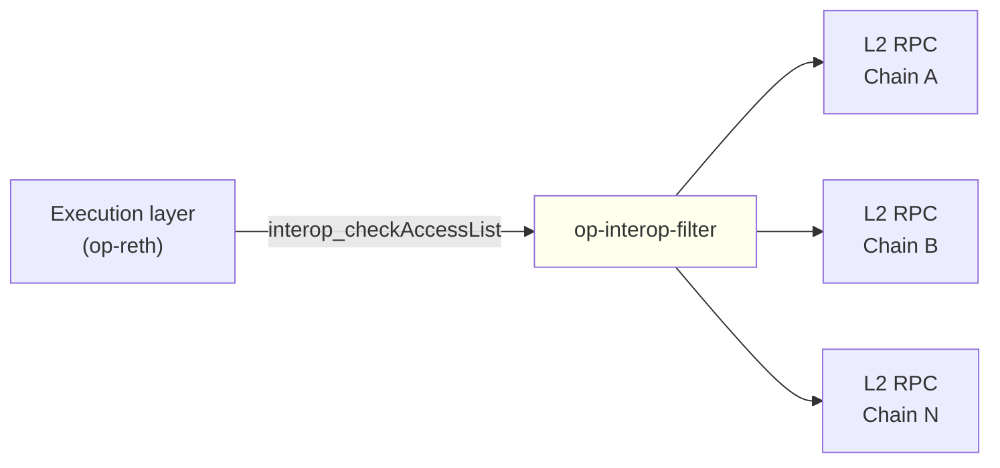

<Info>
  OP Stack interop is in active development.
  op-interop-filter is the service chain operators will run to validate interop transactions for the execution layer, and the interfaces described here may continue to evolve as the rollout progresses.
</Info>

*op-interop-filter* is a lightweight service that validates interop executing messages so that an execution layer (EL) client — op-reth — can reject invalid cross-chain transactions before they reach the sequencer's transaction pool.

It is the service a chain operator runs to answer the `interop_checkAccessList` RPC that the EL calls on every interop transaction.

## What op-interop-filter does

An interop transaction carries an *access list* of references to initiating messages on other chains in the dependency set.
For the transaction to be valid, every referenced initiating message must exist on its source chain at the safety level the executing chain requires.

The EL cannot answer that question on its own.
It calls a configured interop verification endpoint over JSON-RPC (`interop_checkAccessList`) and lets that service decide whether the transaction is admissible.

op-interop-filter is one such service.
It connects to the L2 RPCs of every chain in the dependency set, ingests their logs into a local database, and answers `interop_checkAccessList` against that database.
When the answer is no — or when the filter has lost confidence in its own state — the EL rejects the transaction.

## How it fits into an interop deployment

op-interop-filter sits between an interop chain's EL and the other chains in its dependency set.

The EL points at the filter through op-reth's `--rollup.interop-http` flag and calls the filter's `interop_checkAccessList` method to validate each interop transaction.

This is a different job from what [op-supernode](/op-stack/interop/supernode) does.
The supernode operates at the consensus layer (CL): it verifies that a block's cross-chain dependencies have been reproduced from L1, then promotes the block to *safe* through the chain's own CL.
op-interop-filter works at transaction-admission time instead: it is the separate service the execution layer consults to decide whether an interop transaction may enter the pool in the first place.
A chain operator running an interop chain runs both.

## Failsafe behavior

op-interop-filter has a *failsafe* that, while active, rejects every `interop_checkAccessList` request with `ErrFailsafeEnabled`.
The EL gates interop transactions on that check, so while failsafe is active no interop transactions are admitted.
Regular transactions that carry no interop access-list entries are unaffected and keep flowing normally.

Failsafe activates in one of two ways:

*   **Automatically**, when any chain ingester reports an error — a reorg, a database conflict, data corruption, or an invalid executing message — or when the cross-validator reports an error.
*   **Manually**, when an operator enables it over the admin RPC with `admin_setFailsafeEnabled`.

How failsafe clears depends on why it triggered:

*   A **manual** failsafe clears when the operator calls `admin_setFailsafeEnabled` with `false`.
*   A **reorg-triggered** failsafe clears automatically only when `--reorg-recovery-enabled` is set: the filter rewinds each affected chain's logs database to its finalized block and clears the error.
*   Any failsafe that is neither manual nor auto-resolved — a reorg with `--reorg-recovery-enabled` off, a database conflict, data corruption, an invalid executing message, or a cross-validation failure — has no admin RPC to clear it. Recover by wiping the filter's data directory and restarting the service.

Disabling the manual override with `admin_setFailsafeEnabled` does not clear an error-triggered failsafe; the underlying error has to be resolved first.

## Configuration

op-interop-filter is configured via CLI flags or matching `OP_INTEROP_FILTER_*` environment variables.
The full flag set is defined in [`op-interop-filter/flags/flags.go`](https://github.com/ethereum-optimism/optimism/blob/develop/op-interop-filter/flags/flags.go).

### Required flags

| Flag | Description |
| --- | --- |
| `--l2-rpcs` | L2 RPC endpoints to connect to. The filter queries the chain ID from each endpoint and matches it against a loaded rollup config. |
| `--networks` *or* `--rollup-configs` | At least one is required. `--networks` loads rollup configs by name from the superchain registry; `--rollup-configs` loads custom JSON files for dev or test chains. |

### Key optional flags

| Flag | Default | Description |
| --- | --- | --- |
| `--data-dir` | (temporary directory) | Directory for the LogsDB. Use a persistent path in production so backfill state survives restarts. |
| `--backfill-duration` | `24h` | How far back to backfill on startup. |
| `--message-expiry-window` | `168h` (7 days) | Messages older than this window are treated as expired. |
| `--poll-interval` | `2s` | How often to poll L2 RPCs for new blocks. |
| `--reorg-recovery-enabled` | off | If set, the filter automatically clears reorg-triggered failsafe by rewinding to finalized. |
| `--admin.rpc.addr` | (disabled) | Bind address for the JWT-protected admin RPC. When set, `--admin.jwt-secret` is also required. |

### Use-with-caution flags

Two flags are marked DANGEROUS in source and should only be used with a deliberate operational reason:

| Flag | What it does |
| --- | --- |
| `--dangerously-enable-passthrough` | Lets every transaction through without interop filtering. Disables all executing-message validation. |
| `--support-legacy-check-access-list-format` | Accepts `interop_checkAccessList` requests that omit the executing chain ID. Intended only for compatibility with legacy clients; access-list source-chain validation still runs. |

## RPC surface

op-interop-filter exposes two HTTP RPC endpoints, configured separately.

### Public RPC

Bound by `--rpc.addr` (default `0.0.0.0`) and `--rpc.port` (default `8545`).
Exposes the methods an EL or other consumer needs:

*   `interop_checkAccessList` — validates an executing-message access list at a minimum safety level. This is the method the EL calls on every interop transaction.
*   `interop_getBlockHashByNumber` — returns the latest ingested block hash for a chain, or the hash at a specific height.
*   `admin_getFailsafeEnabled` — read-only check of whether failsafe is currently active.

### Admin RPC

Disabled by default.
Bound by `--admin.rpc.addr` and `--admin.rpc.port` (default `8546`), and protected by a JWT secret loaded from `--admin.jwt-secret`.

The admin RPC exposes the operator-only controls:

*   `admin_setFailsafeEnabled` — manually enable or disable failsafe.
*   `admin_getFailsafeEnabled` — the authenticated read of the same state available on the public RPC.

Admin RPC is intended for operator tooling and should not be exposed publicly.

## Where to go next

*   Read the [interop explainer](/op-stack/interop/explainer) for how cross-chain messaging and executing-message access lists work at the protocol level.
*   Read the [op-supernode page](/op-stack/interop/supernode) for the consensus-layer side of an interop deployment — block-safety promotion and the supernode topology.
*   Read [interop reorg awareness](/op-stack/interop/reorg) for how reorgs interact with cross-chain message safety.
*   For implementation detail, see the [op-interop-filter source](https://github.com/ethereum-optimism/optimism/tree/develop/op-interop-filter) in the monorepo.
