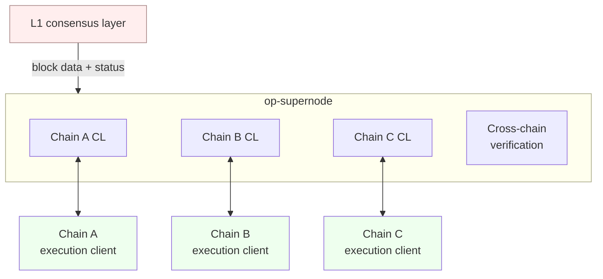
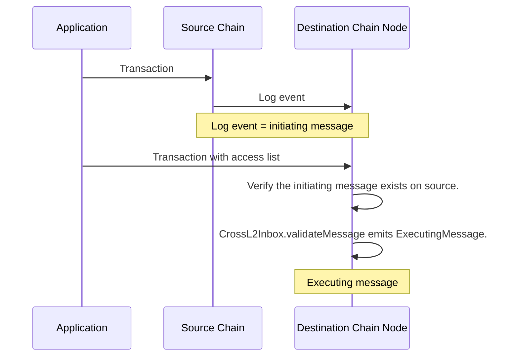
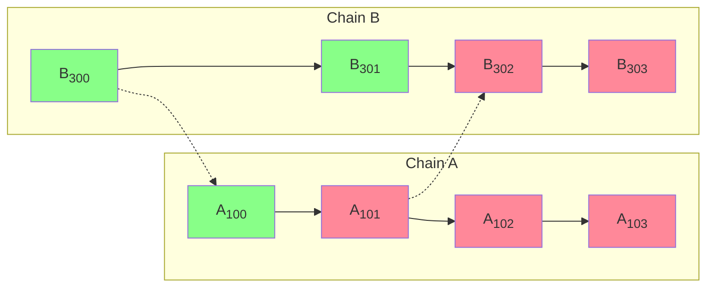
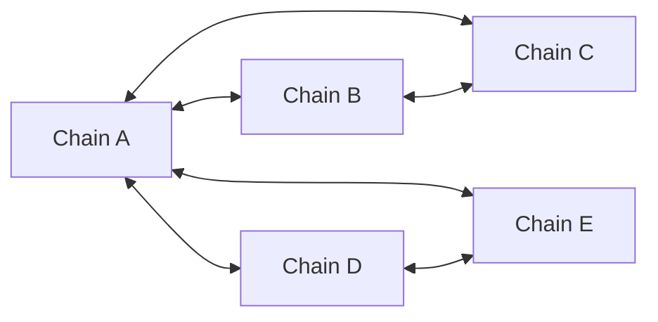
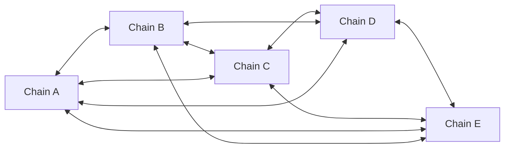

<Info>OP Stack interop is in active development. Some features may be experimental.</Info>

# OP Stack interoperability

It is easy for a blockchain to be certain about information it generates itself.
Information that comes from other sources is harder to provide in a safe, decentralized, and uncensorable manner (this is called [The Oracle Problem](https://chain.link/education-hub/oracle-problem)).
The next major scalability improvement to the OP Stack is to enable a network of chains to feel like a single blockchain.
This goal requires low-latency, seamless message passing and asset bridging.

*OP Stack interoperability* is a set of protocols that lets OP Stack blockchains read each other's state.
OP Stack interoperability provides the following benefits:

*   ETH and ERC-20 tokens move securely between chains via native minting and burning. Asset interoperability solves the issues of liquidity fragmentation and poor user experiences caused by asset wrapping or liquidity pools.
*   Apps can compose with data that exists on other chains.
*   Horizontal scalability for applications that need it.

## Interoperability architecture

A pre-interop OP Stack node consists of two pieces of software: a consensus client (e.g. op-node) that drives derivation, and an execution client that processes user transactions and constructs blocks (e.g. op-geth).

OP Stack interop adds cross-chain message verification on top of that pipeline. Before any chain advances past a block that contains an executing message, the matching initiating message has to be reproduced from the source chain. Tracking every chain in the dependency set is on the critical path: a local block whose dependencies cannot be proved stays unsafe.

That verification work is performed by [op-supernode](/op-stack/interop/supernode), a component that hosts the consensus layer of every chain in a dependency set together and runs the cross-chain checks above the per-chain layer. Each chain's CL stays the single source of truth for safety on its own chain; the supernode signals "advance" or "invalidate" through a narrow authority interface that the CL defers to.



A participant in interop indexes the log events of every chain in its dependency set, because any of those events can serve as an initiating message. It also reads from L1's consensus layer to determine the safety of L2 blocks.

Following every chain in a dependency set is expensive: each one needs derivation, an execution engine, and the cross-chain bookkeeping that interop introduces. op-supernode collapses that cost by running every chain together in a single process, with a shared L1 client and beacon client serving all of them. For a fully-connected cluster like the [Superchain interop cluster](#superchain-interop-cluster), this is the topology the cross-chain verification is designed to run on. See the [op-supernode explainer](/op-stack/interop/supernode) for the architecture.

## How messages get from one chain to the other

A cross-chain message takes two transactions: one on the source chain and one on the destination.



The first transaction creates an *initiating message* on the source chain. The initiating message is just a log event — any log event on any chain in the destination's dependency set can initiate a cross-domain message.

The second transaction creates an *executing message* on the destination chain. It calls the [`CrossL2Inbox`](https://specs.optimism.io/interop/predeploys.html?utm_source=op-docs&utm_medium=docs#crossl2inbox) predeploy to claim that a specific log event happened on a specific source chain. The call to `CrossL2Inbox` can come from an externally owned account or, more commonly, from a smart contract such as the [`L2ToL2CrossDomainMessenger`](https://specs.optimism.io/interop/predeploys.html?utm_source=op-docs&utm_medium=docs#l2tol2crossdomainmessenger).

Each executing message [identifies the initiating message uniquely](https://github.com/ethereum-optimism/optimism/blob/develop/packages/contracts-bedrock/src/L2/CrossL2Inbox.sol#L13-L19) by its source chain ID, the source contract address (`origin`), the source block number, the log index within the block, and the source block timestamp. If everything checks out, `CrossL2Inbox` emits an `ExecutingMessage` event recording the cross-chain reference.

### Validating messages with access lists

`CrossL2Inbox` itself never reads other chains' state. It just verifies that the executing transaction has *pre-declared* every cross-chain message it intends to use, so that the destination chain's node can check those declarations against its index of source-chain logs *before* the transaction is allowed into a block.

The declarations live in the transaction's [EIP-2930 access list](https://eips.ethereum.org/EIPS/eip-2930), targeting the `CrossL2Inbox` predeploy address. For each executing message, the [interop access-list spec](https://specs.optimism.io/interop/predeploys.html#access-list) defines up to three typed storage-key entries:

1.  A **lookup-identity** entry that packs the source chain ID, block number, log timestamp, and log index. This is the hint the node uses to find the referenced log in its index.
2.  An optional **chain-ID extension** entry, only present when the source chain ID does not fit in 64 bits.
3.  A **checksum** entry: a versioned hash that commits to the message's full `Identifier` and message hash. This is the only entry the EVM itself touches.

Before block inclusion, the node iterates over each access-list entry that targets `CrossL2Inbox`, reconstructs the message it points at, and confirms that an initiating log with that identifier and hash really exists on the source chain at the required safety level. Any unrecognized entry, or any entry that points at a message the node cannot prove, fails the check and the transaction is dropped.

Inside the EVM, [`CrossL2Inbox.validateMessage`](https://github.com/ethereum-optimism/optimism/blob/develop/packages/contracts-bedrock/src/L2/CrossL2Inbox.sol#L76-L82) recomputes the checksum from the `Identifier` and `msgHash` it was called with, and uses gas-cost measurement to confirm the matching storage slot is "warm" — meaning the checksum entry really was in the access list. A missing or wrong entry reverts with `NotInAccessList`, so a transaction that bypassed (or contradicts) the node's pre-check can never succeed at runtime. Because deposit transactions cannot carry access lists, calls to `CrossL2Inbox.validateMessage` from inside a deposit always revert.

The access-list mechanism gives sequencers, builders, and verifiers a uniform, EVM-free way to drop transactions whose referenced messages do not exist — including under reorgs and equivocation — before they are ever included in a block.

## Block safety levels

OP Stack interop preserves the same three safety levels app developers and node operators are already used to:



*   **Unsafe**. The block has been produced and shared over the gossip protocol, but its source data has not yet been written to L1. The sequencer that produced it could still equivocate.
*   **Safe**. The block has been derived from data on L1 *and* every initiating message it references has itself reached at least the same safety level. Once a block is safe, no participant — including the sequencer — can roll it back without an L1 reorg.
*   **Finalized**. The L1 data the block was derived from is finalized on L1 and is no longer subject to L1 reorgs.

The crucial property of interop is the second bullet: a block is only treated as safe once everything it depends on is also safe. In the diagram above, blocks B<sub>302</sub> and B<sub>303</sub> on chain B both reference initiating messages from chain A. They cannot become safe until A<sub>101</sub> (and every block leading up to it) has also been written to L1.

This dependency check is what protects users against a [double-spend across chains](/op-stack/interop/reorg). When a sequencer chooses to accept executing messages that reference unsafe initiating messages, it gets the lowest possible cross-chain latency, but it takes on the trust assumption that every sequencer in its [transitive dependency set](#what-is-the-transitive-dependency-set) will eventually post the data it gossiped. If any of them equivocates, the executing-message blocks are reorged out and replaced with deposit-only blocks. For a deeper discussion of the latency / security trade-off and how a chain operator can configure the minimum safety level it will accept for an inbound message, see [Cross-chain security measures](/op-stack/security/interop-security).

<Expandable title="What is the transitive dependency set?">

  The dependency set of a chain is the set of chains it directly accepts initiating messages from. The *transitive* dependency set also includes the dependencies of those chains, and so on.

  ```mermaid

  flowchart LR
      A[Chain A] <--> B[Chain B]
      B <--> C[Chain C]
      B <--> D[Chain D]
      D <--> E[Chain E]
      F[Chain F] <--> G[Chain G]
  ```

  In the picture above, chain A's direct dependency set is `{B}`, but its transitive dependency set is `{B, C, D, E}`. A block on chain D that depends on an unsafe initiating message from chain E remains unsafe until that chain E block is on L1 — and so does every chain B and chain A block that depends on the chain D block.

  Verifying transitively is what lets a chain accept low-latency messages without inheriting unbounded trust from chains it has never heard of: chain A only needs to accept the trust assumptions of chains in its own transitive dependency set.
</Expandable>

## Interop clusters

Each chain configures a *dependency set* — the set of chains it is willing to accept initiating messages from. Together, a group of chains whose dependency sets reach each other forms an interop cluster.



Dependency sets do not have to be symmetric or fully connected. In the example above, chain B's dependency set is `{A, C}`, so a message from chain E to chain B has to be relayed through chain A: send from E to A, then from A to B.

### Superchain interop cluster

The OP Stack builds on top of the underlying interop protocol with a single, fully-connected mesh: every chain in the Superchain interop cluster has every other chain in its dependency set, so any chain can send a message directly to any other.



Every chain in the Superchain interop cluster shares the same security model to mitigate the weakest-link risk of cross-chain messaging. As outlined in the [Standard Rollup Charter](/op-stack/protocol/blockspace-charter), these chains share the same L1 `ProxyAdmin` Owner, and any change to the cluster goes through the standard Protocol Upgrade vote — the established governance process for OP Stack modifications.

Operationally, the fully-connected cluster is the workload [op-supernode](/op-stack/interop/supernode) is built to run: one supernode (or a small high-availability pool) derives every chain in the cluster and verifies cross-chain messages, while the rest of an operator's fleet follows along in a lighter mode.

The Superchain interop cluster is being rolled out iteratively. To see which chains are eligible to join, visit the [Superchain Index](https://www.superchain.eco/superchain-index) and look for chains with a `Standard` charter.

## Next steps

*   Learn [how messages get from one chain to another chain](/app-developers/guides/interoperability/message-passing).
*   Learn how [interop handles reorgs and avoids double-spends](/op-stack/interop/reorg).
*   Read about [op-supernode](/op-stack/interop/supernode), the component that derives every chain in the dependency set together and enforces cross-chain safety.
*   Read the [cross-chain security measures](/op-stack/security/interop-security) for safe interoperability.
