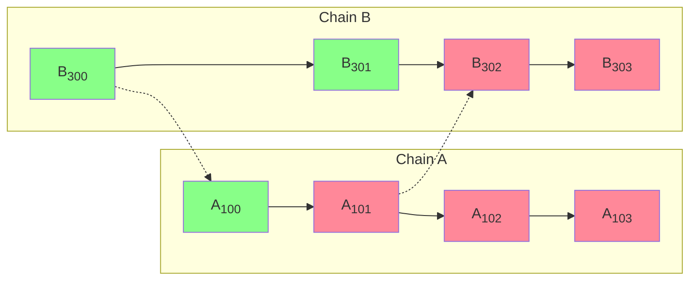
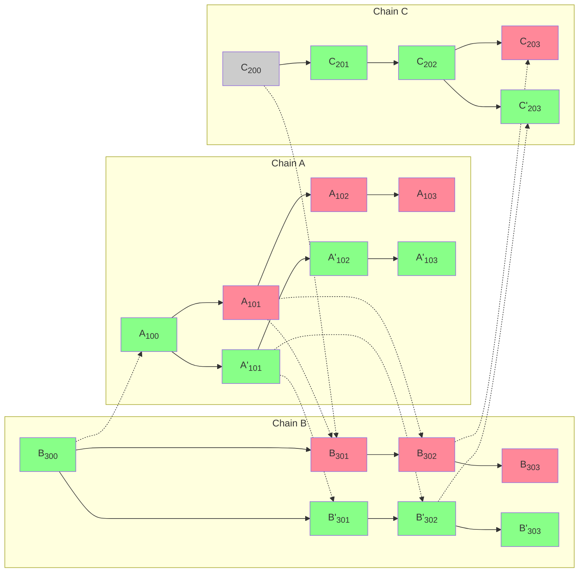

<Info>OP Stack interop is in active development. Some features may be experimental.</Info>

[A chain reorganization, or "reorg",](https://www.alchemy.com/overviews/what-is-a-reorg#what-happens-to-reorgs-after-the-merge) happens when validators disagree on the most accurate version of the blockchain.
If not handled correctly, reorgs in a cross-chain context could result in a [double-spend problem](https://en.wikipedia.org/wiki/Double-spending).
The most frequent solution to mitigate the double-spend problem is to wait for Ethereum finality; however, that solution results in high latency cross-chain communication and a poor user experience.

<Expandable title="What is double-spending?">

  ```mermaid

  flowchart LR 
      subgraph init ["Initiating transaction (source chain)"]
          burn(tokens burned)
          burn-->send(send)
      end
      subgraph exec ["Executing transaction (destination chain)"]
          send==initiating message==>receive(receive)
          receive-->mint(tokens minted)
      end
  ```

  In a normal asset transfer tokens are burned on the source chain first, then a message is sent to the destination chain.
  When that message is received, the tokens are minted on the destination chain, where the user can now use those tokens.

  ```mermaid

  flowchart LR 
      subgraph init ["Not really the source chain"]
          err((error))
      end
      subgraph exec ["Executing transaction (destination chain)"]
          err==initiating message==>receive(receive)
          receive-->mint(tokens minted)
      end
  ```

  A double-spend problem occurs when the destination chain receives a valid initiating message, but due to issues on the source chain, such as a reorg, that initiating transaction is no longer valid.
  When that happens, the tokens are still on the source chain, but they are also on the destination chain.
</Expandable>

Most solutions to mitigate the double-spend problem rely on [L1 finality](https://ethereum.org/en/developers/docs/consensus-mechanisms/pos/#finality). However, that solution results in high latency and poor user experience.

To mitigate the double-spend problem while delivering a low-latency cross-chain experience, OP Stack interop uses [block safety levels](./explainer#block-safety-levels).
This means users can transfer assets across OP Stack chains with 1-block latency, and should a reorg happen, either both the source and destination transactions remain or both of them revert.
In every case, there is no window of opportunity to double spend.

## Block safety levels



In the diagram above, solid arrows show derivation of a block from the previous block in the chain. Dotted arrows go from a block with an initiating message (source) to a block with the matching executing message (destination). Blocks are colored by safety level: finalized (grey), safe (green), or unsafe (red).

Blockchain A has only published block A<sub>100</sub> to L1. Block A<sub>101</sub> is still unsafe, and so is every block that depends on it — directly (A<sub>102</sub> and B<sub>302</sub>) or indirectly (A<sub>103</sub> and B<sub>303</sub>). Even if blocks B<sub>302</sub> and B<sub>303</sub> have themselves been written to L1, they cannot become safe until A<sub>101</sub> does, because a block is only treated as safe once every initiating message it references is also at least safe. When A<sub>101</sub> eventually lands on L1, the chain of dependent blocks can promote in turn.

The message between A<sub>101</sub> and B<sub>302</sub> can be an asset moving across the bridge.
In that case, the initiating message (A<sub>101</sub>) burns `n` tokens on the source chain (A), and the executing message (B<sub>302</sub>) mints `n` tokens on the destination chain (B).

### L1 reorg

L1 reorgs typically happen at the unsafe head — only the most recent L1 blocks, before they have enough confirmations to be considered safe. The op-node already filters L1 derivation through L1 safe and finalized labels, so almost all L1 reorgs never reach the L2 derivation pipeline at all.

When an L1 reorg does affect L2, one of two things happens:

* **The replacement L1 block carries the same batch data as the original.** Derivation is deterministic, so the L2 chain it produces is identical, and the reorg is a no-op from the L2 perspective.
* **The replacement L1 block does not carry that batch data.** The sequencer notices and reposts the affected batch in a later L1 block. As long as the batch lands again before the [sequencer window](https://specs.optimism.io/glossary.html#sequencing-window) elapses (3600 L1 blocks ≈ 12 hours on standard chains like OP Mainnet and Unichain), derivation reproduces the same L2 chain. If the window does elapse without the batch reappearing, the affected L2 blocks are replaced with deposit-only blocks (see [Invalid block](#invalid-block) below).

The takeaway is that L1 reorgs do not by themselves break interop guarantees: either the data comes back and L2 stays identical, or the chain falls back to deposit-only blocks for that span — the same behavior as if the sequencer had simply gone offline.

### Equivocation

Sequencers inform the rest of the OP Stack chains about a new block in two ways:

*   The gossip protocol, which is typically used as soon as the block is created.
    The problem is that the gossip protocol does not create a commitment.
*   Posting to L1, which typically happens a few minutes after the block is created.
    The reason is cost; it is much cheaper if compression and L1 posting are done in large batches rather than for each individual block.

Equivocation happens when a sequencer publishes a block over the gossip protocol that differs from the one that eventually gets written to L1. The L1 version wins, and every dependent block — local or cross-chain — has to be recomputed against the new history.



A block in another chain can only depend on a specific block here if it referenced one of that block's logs in an executing message — and a block only earns the safe label once every initiating message it depends on has also reached at least safe. So the equivocation between A<sub>101</sub> and A'<sub>101</sub> only invalidates *unsafe* blocks: A<sub>102</sub> and A<sub>103</sub> on chain A (extending the bad history), B<sub>301</sub> and B<sub>302</sub> on chain B (which referenced A<sub>101</sub> directly) along with B<sub>303</sub> (which follows them on chain B), and C<sub>203</sub> on chain C (which referenced B<sub>302</sub>). All those unsafe blocks are reorged out and replaced by the corresponding `'`-marked blocks, which derive from A'<sub>101</sub>. Anything previously labeled safe or finalized is untouched.

### Invalid block

A block can also be canonically invalidated outright. If verifiers determine that an L2 block cannot be reproduced from L1 — for example because the batch claims an initiating message that does not exist on the source chain — the canonical chain replaces it with a *deposit-only block*: a block that contains only the deposit transactions forced through L1, with all sequencer transactions stripped out.

<Expandable title="What makes a block invalid?">

  There are several potential reasons:

  *   The block posted to L1 includes incorrect information — for example, a batch claims an initiating message that the source chain never actually emitted, so any executing message that references it cannot be reproduced.
  *   The block was never posted at all. If the [sequencer window](https://specs.optimism.io/glossary.html#sequencing-window) elapses (3600 L1 blocks ≈ 12 hours on standard chains) without a batch covering an L1 epoch, verifiers fall back to a deposit-only block for that epoch.
</Expandable>

Functionally this is equivalent to equivocation, and the dependency rules above handle it the same way: only unsafe blocks (and any chain of blocks depending on them transitively) are reshaped, and any block that had already reached the safe label is untouched.

{/* 
### L2 reorg

An L2 reorg could happen after the sequencer is decentralized.
In that case, there is a deterministic FCU (fork choice update), just as there is on L1.
At worst, some unsafe blocks need to be recalculated (if one fork is chosen over another).
*/}

## Next steps

*   Read the [interop explainer](./explainer) for the rest of the architecture.
*   Read about [op-supernode](./supernode), the component that derives every chain in the dependency set together and enforces the safety levels described above.
*   Read the [cross-chain security measures](/op-stack/security/interop-security) for safe interoperability.
*   View more [interop guides and tutorials](/app-developers/guides/interoperability/get-started).
