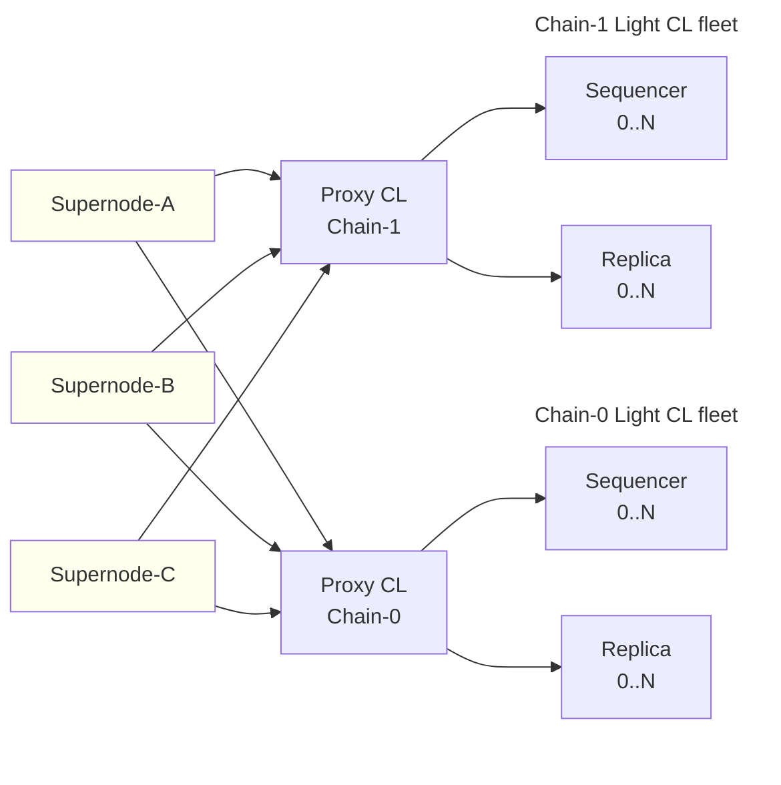

<Info>
  OP Stack interop is in active development.
  op-supernode is the runtime that operators of interop chains will run, and the architecture and interfaces described here may continue to evolve as the rollout progresses.
</Info>

# OP Supernode

*op-supernode* is a component that runs every chain in an interop dependency set together as virtual nodes inside one binary.
Where a pre-interop deployment runs one op-node per chain, op-supernode hosts every chain side by side, shares the L1 and beacon-chain plumbing across them, and adds the cross-chain message verification work that interop needs.

## Why op-supernode exists

OP Stack interop changes what a single node has to do.
Before interop, a node only had to derive its own chain.
With interop, a node has to derive *every chain in its dependency set*, because any of those chains can emit an initiating message that the local chain depends on.
The local chain cannot advance past a block whose dependencies it cannot prove, so the derivation of every other chain in the set is on the critical path.

Without consolidation, every operator runs a full op-node and execution client for every chain in the dependency set.
That duplicates the L1 client, the beacon-chain client, the derivation pipeline, the storage layout, and the operational glue around each one.
For a fully-connected dependency set — the configuration the [Superchain interop cluster](/op-stack/interop/explainer#superchain-interop-cluster) targets — the duplication scales with the size of the cluster.

op-supernode collapses that duplication.
It runs each chain as an in-memory *virtual node* inside one process, with a single L1 client and a single beacon client serving all of them, and adds the cross-chain message verification work above the per-chain layer.

## How op-supernode works

The supernode is composed of *chain containers* and *activities*.
Each chain container hosts one virtual node for one chain.
Activities are modular components that operate above the chain layer, with access to every chain.

### Chain containers

A *chain container* is the supernode's wrapper around one chain.
Inside a chain container is a *virtual node*: a consensus-layer (CL) implementation hosted in-process rather than as a separate operating-system process.
Today the only virtual node implementation is op-node itself, hosted as a library; the chain container manages its lifecycle (start, stop, pause, resume) and exposes a stable interface to the rest of the supernode.

Chain containers also drive the execution engine for the chain through an engine controller.
They expose the operations the supernode needs to verify cross-chain messages — deriving the local-safe block at a timestamp, fetching receipts, answering output-root queries — without reaching into the internals of any one chain.

### Shared resources

Running every chain inside one process makes shared resources possible.

*   A single **L1 RPC client** and a single **L1 beacon client** serve every chain. Cache hits on L1 blocks and blob lookups carry across chains.
*   The **JSON-RPC surface** is namespaced per chain. `11155420/` reaches OP Sepolia's RPC; `1301/` reaches Unichain Sepolia's. Tools that expect an op-node-shaped endpoint reach a chain by addressing it through that prefix.
*   **Metrics** are namespaced per chain via the same scheme.
*   **Data directories** are namespaced so SafeDB and P2P state for one chain cannot collide with another's.

Some flags are intentionally owned at the supernode level rather than per chain.
`--l1` and `--l1.beacon` configure the shared L1 plumbing, and any per-chain override of them is silently replaced with the top-level value.

### Activities

An *activity* is a modular component that operates above the chain layer rather than inside any one chain.
Each activity can register an RPC namespace on the supernode root, expose Prometheus metrics, and run a goroutine for as long as the supernode is up.

The supernode ships with a small set of activities:

*   **Heartbeat** — emits a liveness signal and exposes `heartbeat_check` over JSON-RPC.
*   **SuperRoot** — produces a *super root*: a commitment over verified L2 blocks across the dependency set at a given timestamp. Exposed as `superroot_atTimestamp`. The fault proof system needs this commitment to produce an interop-aware proof.
*   **Supernode** — exposes `supernode_syncStatus`, an aggregate per-chain sync status across the dependency set.
*   **Interop** — does the actual cross-chain message verification (see the next section).

## Cross-chain message safety

The interop activity is the part of op-supernode that decides when a chain's blocks have satisfied their cross-chain dependencies and can be promoted past unsafe.
It runs above the chain containers and reaches into them through a narrow interface.

For every block produced on every chain, the interop activity answers one question: have all the initiating messages this block executes been reproduced from L1, and at the same safety level the destination block is trying to reach?
The activity decides per round between *wait*, *advance*, *invalidate*, and *rewind*.
The decision is recorded in a write-ahead log so the supernode can pick up after a restart in the same state it was in before.

When the answer is *advance*, the supernode signals the chain's CL to promote the block.
The signal flows through an *authority* interface that the chain container holds and the virtual node defers to: the supernode advances safety on a chain only via the chain's own CL.
The CL stays the single source of truth for safety on its chain, and the execution layer (EL) never has to learn about interop.

When the answer is *invalidate* or *rewind*, the supernode tells the chain to back out the affected blocks.
A block on chain B that referenced a chain-A log can be invalidated because the chain-A log never made it to L1, or because the L1 record contradicts what was gossiped over P2P.
See [Interop reorg awareness](/op-stack/interop/reorg) for how that plays out at the chain level.

The user-facing safety levels do not change.
Block safety levels (*unsafe*, *safe*, *finalized*) are still defined as they are without interop, and the EL's view of those labels matches.
The supernode's role is to make sure the labels mean what they say once cross-chain dependencies are part of the picture.

## op-supernode and Light CL

op-supernode pairs with the *Light CL* mode of op-node and kona-node.
A Light CL turns off local derivation and mirrors safe and finalized state from a trusted external source over the `optimism_syncStatus` RPC.
It still advances the unsafe chain over P2P; only the safe and finalized views are delegated.

Together, supernode and Light CL form a topology:

*   One trusted op-supernode (or a small high-availability pool of them) runs derivation for every chain in the dependency set, plus the interop activity that promotes blocks to safe.
*   The rest of the operator's fleet runs op-node or kona-node in Light CL mode, points at the supernode's `optimism_syncStatus`, and inherits its safe and finalized view.
*   Node operators run the same setup, minus the sequencer Light CLs (only the chain operator produces blocks).

This split is what makes interop tractable for operators who already run dozens or hundreds of nodes per chain.
The expensive multi-chain derivation work happens once, on the supernode; the rest of the fleet stays cheap.

## Where to go next

*   Read the [interop prep notice](/notices/interop-prep) for the node-operator action checklist for the OP Sepolia and Unichain Sepolia activation.
*   Read the [supernode configuration guide](/node-operators/guides/configuration/supernode) for the flag reference and a starter configuration.
*   Read the [specialized op-node topology notice](/notices/specialized-node-topology) for the operator-facing pattern of running light op-nodes with `--l2.follow.source`, the fleet-side of the supernode-plus-light-CL topology.
*   Read [interop reorg awareness](/op-stack/interop/reorg) for how the safety model handles equivocation and L1 reorgs.
*   Read the [cross-chain security measures](/op-stack/security/interop-security) for how an operator can configure the safety level it requires for inbound messages.
*   Read the [interop explainer](/op-stack/interop/explainer) for how cross-chain messaging works at the protocol level.
*   For implementation detail, see the [op-supernode source](https://github.com/ethereum-optimism/optimism/tree/develop/op-supernode) in the monorepo.
