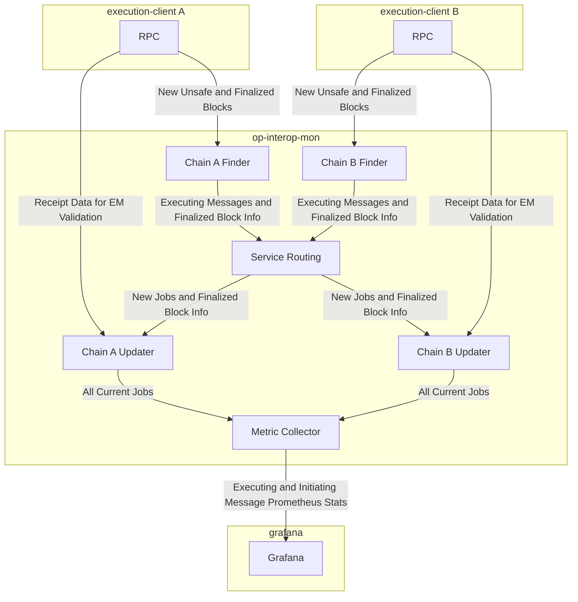

# Optimism Interop Monitor

## Purpose
The Optimism Interop Monitor is a service that monitors Executing Messages between OP Protocol chains to detect and report any invalid messages on chains. It helps ensure the reliability and correctness of cross-chain communication.

Interop Monitor's primary output is a collection of metrics which can alert operators for fast response and insight.
The design of this service follows the [Design Doc](https://github.com/ethereum-optimism/design-docs/pull/222).

## Validity model

The monitor is an **independent watchdog**: it reads each chain's L2 receipts directly and decides
validity itself, rather than trusting any other service. For every Executing Message it validates,
against the *initiating* chain's block, that:

- the initiating log exists at the referenced log index,
- the log address matches the message's declared `Origin`,
- the initiating block timestamp matches the timestamp bound into the message identifier
  (otherwise `timestamp_mismatch`),
- the payload hash matches, and
- the message is within the expiry window — i.e. `init.Timestamp <= exec.Timestamp <= init.Timestamp + MessageExpiryWindow`
  (otherwise `expired`).

These checks together are equivalent to the `MessageChecksum` binding used by `interop_checkAccessList`.

The chain set and the message expiry window are sourced from an interop dependency-set JSON file via
`--dependency-set` (the same format consumed by `op-supernode` / `op-node`).

This service belongs to the post-`op-supervisor` interop topology: `op-supernode` (consensus layer,
makes the cross-chain safety decision), Light CL follower nodes, and `op-interop-filter` (execution
layer, holds the failsafe and answers `interop_checkAccessList`). The monitor optionally cross-checks
the interop-filter and supernode read-only (see flags) but never depends on them to function.

## Optional cross-checks

These observers are read-only and never gate the monitor's own verdict; they only emit additional
observability metrics. They degrade gracefully if the observed service is unreachable.

- `--interop-filter-endpoint` (with `--interop-filter-min-safety`, default `cross-unsafe`): replays
  each terminal job's executing message to `interop_checkAccessList` and records
  `filter_divergence_total{executing_chain_id,initiating_chain_id,monitor_status,filter_status}` when
  the filter disagrees with the monitor. Also polls `admin_getFailsafeEnabled` into the
  `interop_filter_failsafe` gauge.
- `--supernode-endpoints` (repeatable): for each `op-supernode`, probes `heartbeat_check` into
  `supernode_up{endpoint}`, records per-chain `supernode_safe_head{chain_id,level}` (levels
  `cross_safe` and `finalized`) from `supernode_syncStatus`, and increments
  `cross_safety_violations_total{executing_chain_id,initiating_chain_id,level}` when a bad executing
  message (`invalid`/`expired`/`timestamp_mismatch`) is observed at or below the supernode's cross-safe head.

## Architecture
The service consists of several key components working together:

- A main service (`InteropMonitorService`) that coordinates everything
- A set of RPC Clients specified from command line, and given to each sub-component
- Multiple `Finder` instances that scan chains for relevant transactions
- Multiple `Updater` instances that take `job`s for their chain and update them
- A `MetricCollector` that regularly scans ongoing jobs to emit gauge metrics

The components use a collection of channels, callbacks and visitor-pattern style data collection to share Job information.

## MetricCollector
The `MetricCollector` consolidates metrics from all jobs across chains. It:

- Scans all jobs from all updaters periodically
- Tracks executing message metrics by:
  - Chain ID
  - Block number
  - Block hash
  - Message status
- Tracks initiating message metrics by:
  - Chain ID
  - Block number
  - Message status
- Detects and records terminal state changes (valid->invalid or invalid->valid)
- Emits metrics for:
  - Executing message stats per chain/block/status (statuses: `valid`, `invalid`, `expired`, `timestamp_mismatch`, `unknown`)
  - Initiating message stats per chain/block/status
  - Terminal status changes between chains
  - Initiating-chain reorgs (`initiating_reorgs_total`): a job whose initiating block was observed at more than one hash

### Updaters
`Updater`s are chain specific processors that take `job`s and update them:
- Maintains a map of all `job`s it is updating
- Evaluates all `job`s regularly
- Expires old `job`s based on Finality of both Initiating and Executing side
- Operates independently per chain

## Finders
`Finder`s scan individual chains for relevant transactions. Each Finder:

- Subscribes to new blocks on its assigned chain
- Processes block receipts to identify Executing Messages
- Creates `job`s for each relevant transaction found
- Sends `job`s to the Finders (via a centralized router)
- Operates independently per chain

## Jobs
`job`s represent individual Executing Messages that need to be tracked. A `job` contains:

- Timestamps for first/last seen
- Transaction hashes and Initiating/Executing identifiers
- Current status and status history
- More, as needed by the service

`job`s move through different states (`unknown` -> `valid`/`invalid`/`expired`/`timestamp_mismatch`) as the updater processes them.
