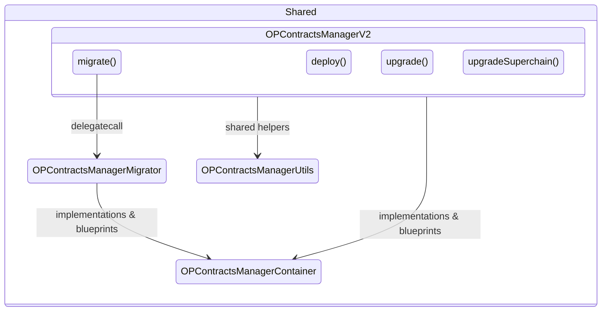

# OP Contracts Manager (OPCM)

The OPCM is an important smart contract that is used to orchestrate OP Chain deployments and upgrades. It is responsible
for the following:

1. Keeping track of the canonical implementation contracts for each [contracts release][versioning].
2. Deploying new L1 contracts for each OP Chain.
3. Upgrading from one contract release to another.
4. Migrating chains to superproofs.

All contract upgrades that touch live chains **must** be performed via the OPCM. This guide will walk you through
the OPCM's architecture, and how to hook your contracts into it.

[versioning]: ../policies/versioning.md

## Architecture

The OPCM consists of multiple contracts:

1. `OPContractsManagerV2`, which serves as the entry point for `deploy()`, `upgrade()`, `upgradeSuperchain()`, and `migrate()`.
2. `OPContractsManagerUtils`, which contains shared helper logic used by deploy and upgrade operations.
3. `OPContractsManagerContainer`, which is a repository for contract implementations and blueprints.
4. `OPContractsManagerMigrator`, which handles migrating chains to superproofs (called via delegatecall from `migrate()`).

They fit together like the diagram below:

One OPCM is deployed per smart contract release per chain. Each OPCM supports deploying a new chain at its
corresponding smart contract release, and upgrading existing chains from one version prior to its corresponding
smart contract release. Chains that are multiple versions behind must be upgraded in multiple stages across multiple
OPCMs.

The OPCM supports upgrading Superchain-wide contracts like the `SuperchainConfig`.

## Usage

Typically, users do not call into the OPCM directly. Instead, they use [OP Deployer][deployer] to either directly
call `deploy` when spinning up a new chain or generate calldate for use with `upgrade`.

If you want to call the OPCM directly, check out the implementation to see exactly what the inputs and outputs are
to each method. This changes between releases, and will not be covered directly here.

[deployer]: https://devdocs.optimism.io/op-deployer

## Updating the OPCM

Whenever you make updates to in-protocol contracts, you'll need to make corresponding changes inside the OPCM. While
the details of each change will vary, we've included some general guidelines below.

### Updating OPContractsManagerV2

All deploy, upgrade, and migration logic lives directly in `OPContractsManagerV2` (with migration delegating to
`OPContractsManagerMigrator`). When modifying these keep the following tips in mind:

- The `deploy` method can typically be modified in-place since the deployment process doesn't change much from
  release to release. For example, most changes to the `deploy` method will involve either adding a new contract or
  modifying the constructor/initializer for existing contracts. You can use the existing implementation as a guide.
- The `upgrade` method changes much more frequently. That said, you can still use the existing implementation as a
  guide. Just make sure to delete any old upgrade code that is no longer needed. `OPContractsManagerUtils` contains
  helpers for things like deploying new dispute games and upgrading proxies to new implementations.
- The `upgrade` method will _always_ set the RC on the OPCM to false when called by the upgrade controller. It will
  only sometimes (depending on your specific upgrade) upgrade Superchain contracts.

### Fork Tests

The OPCM is tested using fork tests. These tests fork mainnet and "run" the upgrade against OP Mainnet. This allows
us to validate that the upgrades work as expected in CI prior to deploying them to betanets or production.

To run fork tests, run `just test-upgrade`. You will need to set `ETH_RPC_URL` to an archival mainnet node.

When multiple upgrades are in flight at the same time, the fork tests stack upgrades on top of one another. Since the
tip of `develop` must contain the implementation for the latest upgrade only, fork tests that run upgrades prior to
the latest one must use deployed instances of the OPCM. For example, as of this writing upgrades 13, 14, and 15 are
all in flight. Therefore, the fork tests will use deployed versions of the OPCM for upgrades 13 and 14 and whatever
is on `develop` for upgrade 15. See `OPContractsManagerV2.t.sol` for the implementation of the fork tests.

## Modifying Contracts for Upgrade

When making changes to a contract there are few situations to bear in mind.

### The contract's `initializer()` is updated

Typically a contract's `initializer()` will be modified when a new storage variable is added which
needs to be set. This may either be done by adding a new argument to the `initializer()`, by
reading a value from the environment, or by reading a value from another contract.

Whatever the case, a new `upgrade()` method should also be added which uses the same logic to set
the new storage variable.

In addition, the contract should inherit from `ReinitializableBase` and the `initializer()` and `upgrade()`
methods should have the `reinitializer(reinitVersion())` modifier.

The OPCM must then use `ProxyAdmin.upgradeAndCall()` to call the `upgrade()` method. Additionally, if the
input value is not read from the chain, then it will need to be passed in as input. This will
require a new field to be added to the `OpChainConfig` struct.

### New derivation path events are being added

If a contract emits events which have an impact on the derivation path of a chain (this most often
occurs when a new `UpdateType` is added to the `SystemConfig.ConfigUpdate()` event), the best
practice is to:

1. Not emit the new event in the `initialize()` method (and not add an `upgrade()` method)
1. Have the `op-node` default to some value for that config.
1. Add a setter function with appropriate auth checks for the new config value.

This pattern has a few benefits. It enables L1 contracts to be upgraded in advance of an L2 hardfork
which reads these events. Another benefit is that it avoids the need to provide the new config value
as an input to the `OpChainConfig`, thus helping to keep the interface of the OPCM stable.

### No new storage variables or derivation path events are added

In this case no changes are required to `initialize()`, no new `upgrade()` method is needed, and the
OPCM can simply use the `ProxyAdmin.upgrade()` method to upgrade the contract.
