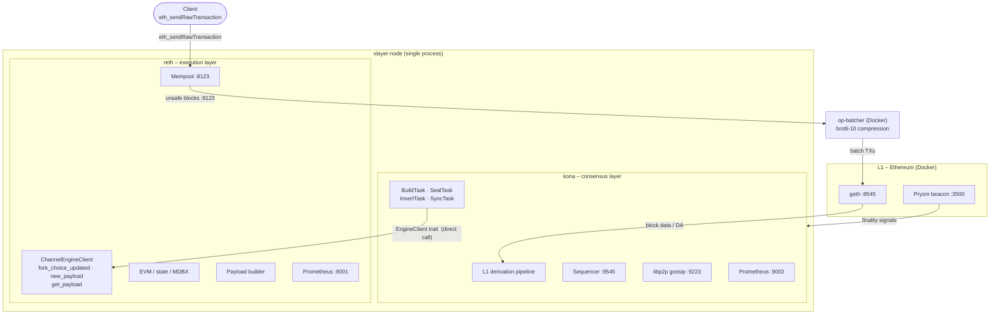
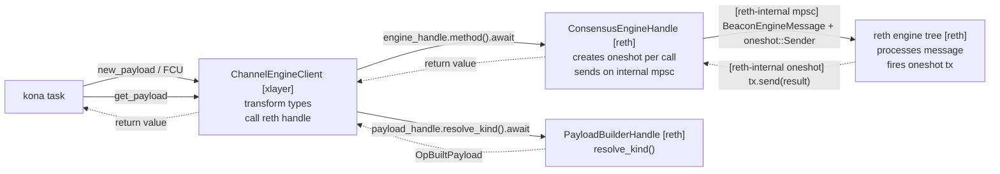
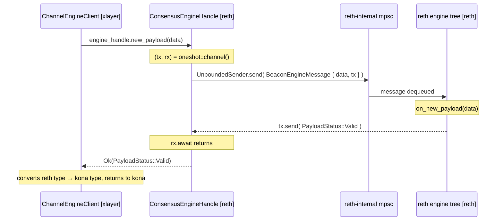
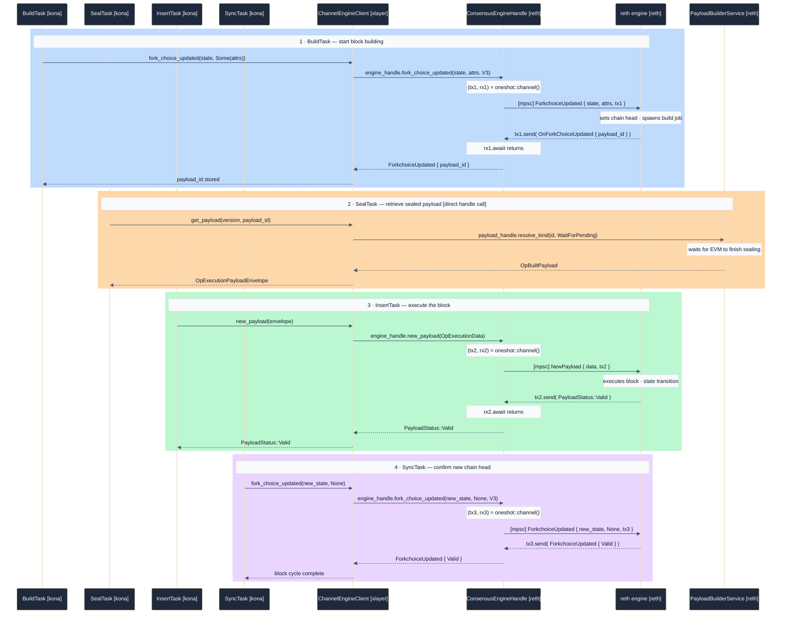

# xlayer-node

**xlayer-node** is the sequencer for the XLayer L2 network — a single binary that fuses reth (execution) and kona (consensus) into one process, eliminating the HTTP Engine API hop between them.

Built on the OP Stack. Produces blocks at 1-second intervals. Derives finality from Ethereum L1.

---

## The Core Idea

Standard OP Stack sequencers run two processes that talk over HTTP:

```
op-node  ──HTTP Engine API (JWT :8552)──►  op-reth / op-geth
```

xlayer-node collapses them into one:

```
┌─────────────────────────────────────────────┐
│               xlayer-node                   │
│                                             │
│   kona ──ChannelEngineClient──► reth        │
│   (consensus)    (in-process)   (execution) │
└─────────────────────────────────────────────┘
```

`ChannelEngineClient` implements the same `EngineClient` trait kona uses for HTTP — but routes every call in-process to reth's native handles:

- **No network** — calls go directly to `ConsensusEngineHandle` and `PayloadBuilderHandle`; no socket is touched
- **No serialization** — plain async Rust method calls; no JSON encoding or decoding
- **No JWT** — authentication is meaningless between two halves of the same binary

The mpsc+oneshot channel mechanics live entirely inside reth. xlayer's only role is type transformation — converting kona types to reth types, then calling through.

---

## System Architecture



---

## Block Production Flow

Every 1 second:

```
1. User submits TX
   └─ eth_sendRawTransaction → reth mempool (:8123)

2. Kona triggers block build
   └─ fork_choice_updated(head, attrs) → ChannelEngineClient → reth
      Returns: PayloadId

3. Reth builds payload
   └─ EVM executes TXs, seals block
      Stores in PayloadBuilderService (in-memory)

4. Kona retrieves sealed block
   └─ get_payload(PayloadId) → ChannelEngineClient → reth
      Returns: OpBuiltPayload { execution_payload, block_hash }

5. Kona gossips unsafe block
   └─ libp2p gossipsub → peer nodes (if any)
   ◉ unsafe_l2 head advances

6. op-batcher submits batch to L1
   └─ Accumulates unsafe blocks → compress → eth_sendRawTransaction → L1 geth
   └─ L1 mines the batch TX

7. Kona re-derives from L1
   └─ kona reads batch TX from L1 → reconstructs L2 block
   └─ new_payload(reconstructed) → ChannelEngineClient → reth
      reth validates: "VALID" iff hashes match
   ◉ safe_l2 head advances

8. L1 PoS finalizes
   └─ Two epochs (~64 L1 blocks) of attestations
   └─ kona sees finality signal from beacon API
   ◉ finalized_l2 head advances
```

**Timings (devnet)**:

| Phase | Trigger | Typical latency |
|-------|---------|----------------|
| TX → Unsafe | reth seals block | < 2s |
| Unsafe → Safe | batcher submits + L1 mines + kona derives | 8–20s |
| Safe → Finalized | L1 PoS (2 epochs × ~8 validators) | 20–40s |

---

## Components

| Component | What it is | Where it runs |
|-----------|-----------|--------------|
| **reth** | OP Stack execution client (EVM, state, RPC) | in-process |
| **kona** | OP Stack consensus client (L1 derivation, sequencer, P2P) — Rust reimplementation of op-node | in-process |
| **ChannelEngineClient** | In-process Engine API bridge (reth ↔ kona via tokio channels) | in-process |
| **L1 geth** | Standard go-ethereum, archive mode, PoS via Prysm | Docker |
| **L1 beacon (Prysm)** | Ethereum PoS consensus. Finality source for L2 | Docker |
| **L1 validator** | 4-validator Prysm set for devnet block production | Docker |
| **op-batcher** | Official OP Stack batcher. Reads L2 blocks, compresses and posts to L1 | Docker |

### What xlayer-node does NOT include

- **op-proposer** — not running. L2 output roots not submitted. Fine for sequencer-only operation.
- **op-challenger** — not running. Fault proofs not active.
- **L2 verifier node** — not included. Add a second xlayer-node instance in `--sequencer=false` mode.

---

## Key Data Structures

### ChannelEngineClient

The only custom code in this repo (`crates/engine-bridge/src/client.rs`).

```rust
pub struct ChannelEngineClient {
    // Direct handles into reth internals (no HTTP)
    engine_handle:  ConsensusEngineHandle<OpEngineTypes>,
    payload_handle: PayloadBuilderHandle<OpEngineTypes>,

    // Chain config (hardforks, contract addresses)
    cfg: Arc<RollupConfig>,

    // HTTP providers — reth's own RPC endpoint for L2 block queries
    l2_provider: RootProvider<Optimism>,

    // L1 HTTP provider — read L1 state (proofs, balances, EIP-4788)
    l1_provider: RootProvider,
}
```

**Why L2 uses HTTP even in-process**: The `l2_provider` queries reth's own `:8123` endpoint for committed state. Direct database access is not exposed by reth's public API surface; HTTP is the stable interface.

### OpExecutionPayloadEnvelope (the block wire format)

```
OpExecutionPayloadEnvelope
├── OpExecutionPayload (the block data)
│   ├── V1 (pre-Canyon): base fields
│   ├── V2 (Canyon): + withdrawals: []
│   ├── V3 (Ecotone): + blob_gas_used, excess_blob_gas
│   └── V4 (Isthmus/Prague): + requests_hash
└── OpExecutionPayloadSidecar
    ├── CancunPayloadFields { parent_beacon_block_root, versioned_hashes }
    └── PraguePayloadFields { requests_hash: EMPTY_REQUESTS_HASH }
        ← required for V4; OP EL requests are always empty per spec
```

**V4 Sidecar Rule**: OP Stack never has EL execution requests (unlike Ethereum mainnet). But `requests_hash` must still be present and set to `EMPTY_REQUESTS_HASH` for the block hash to be consistent between builder and validator.

### RollupConfig (from kona-genesis)

Governs the entire L2 chain behavior:

```rust
RollupConfig {
    genesis: ChainGenesis {
        l1: BlockID { hash, number },   // L1 anchor block
        l2: BlockID { hash, number },   // L2 genesis block
        l2_time,                        // L2 genesis timestamp
        system_config: { batcher_addr, gas_limit, scalar, overhead }
    },
    block_time: 1,
    max_sequencer_drift: 600,          // max seconds without new L1 block
    seq_window_size: 7200,             // ~2 hours: TX deadline window
    l1_chain_id: 1337,
    l2_chain_id: 195,
    batch_inbox_address,               // where batcher posts data
    deposit_contract_address,          // OptimismPortal on L1
    l1_system_config_address,          // SystemConfig on L1
    regolith_time: Some(0),
    isthmus_time: Some(0),             // all forks at genesis for devnet
}
```

### ForkchoiceState (Engine API state machine)

Three pointers into the block tree:

```
finalized_hash ──► safe_hash ──► head_hash
     │                │              │
  Finalized         Safe           Unsafe
  (PoS sealed)   (on L1 chain)   (sequencer tip)
```

kona updates these after each derivation step. reth uses them to determine its canonical chain.

---

## Engine Bridge — Channel Design

`ChannelEngineClient` (`crates/engine-bridge/src/client.rs`) is the only custom code in this repo. It is a thin type-transformation + dispatch layer. **All channel mechanics live inside reth** — xlayer just calls reth's handles directly.

### What main.rs actually does

```
1. reth launches first, returns a handle
2. xlayer extracts two handles from the running reth node:
     reth_engine_handle  = reth_handle.node.add_ons_handle.beacon_engine_handle.clone()
     reth_payload_handle = reth_handle.node.payload_builder_handle.clone()
3. ChannelEngineClient::new(reth_engine_handle, reth_payload_handle, ...)
4. rollup_node.start_with_client(Arc::new(engine_client))
     → kona receives the client and uses it for every engine call
```

xlayer owns no channel. No relay task. No buffer. It holds reth's handles and calls methods on them.

---

### Two Call Paths

| Call | What xlayer does | Where channel logic lives |
|------|-----------------|--------------------------|
| `new_payload` / `fork_choice_updated` | type transform → `engine_handle.method().await` | inside `ConsensusEngineHandle` [reth] |
| `get_payload` | `payload_handle.resolve_kind().await` | inside `PayloadBuilderHandle` [reth] |
| `get_l1_block`, `get_l2_block`, `get_proof` | HTTP provider call | L1/L2 RPC — not on hot path |



---

### How the Oneshot Works — Inside reth's ConsensusEngineHandle

`ChannelEngineClient` calls `self.engine_handle.new_payload(data).await`. That method is owned by reth:

```
ConsensusEngineHandle::new_payload(data):           ← reth code, not xlayer

  let (tx, rx) = oneshot::channel()                 ← fresh pair for this call only
  self.to_engine.send(
      BeaconEngineMessage::NewPayload { payload: data, tx }
  )                                                  ← tx travels WITH the payload into reth
  rx.await                                           ← xlayer's call parks here

reth engine tree (poll loop):
  dequeues BeaconEngineMessage::NewPayload { payload, tx }
  on_new_payload(payload)                            ← executes the block
  tx.send(PayloadStatus::Valid)                      ← fires the oneshot

rx.await unblocks → ConsensusEngineHandle returns to ChannelEngineClient → returns to kona
```



The `oneshot::Sender` is the return address embedded inside the message. reth fires it when done. No request IDs, no shared response table — each call has its own private channel pair, created and dropped in one round-trip.

---

### BeaconEngineMessage — The Wire Type

```
BeaconEngineMessage::NewPayload {
    payload: OpExecutionData,                           ← block to execute
    tx:      oneshot::Sender<Result<PayloadStatus, _>>, ← return address back to CEH
}

BeaconEngineMessage::ForkchoiceUpdated {
    state:         ForkchoiceState,          ← head / safe / finalized hashes
    payload_attrs: Option<OpPayloadAttributes>,
    //             Some → update head + start building next block
    //             None → update head only, no new build job
    version:       EngineApiMessageVersion,
    tx:            oneshot::Sender<RethResult<OnForkChoiceUpdated>>,
}
```

---

### Per-Block Cycle — Four Engine Calls

kona runs four tasks per L2 block (1 second). Each blocks until the full round-trip through reth completes.



**`PayloadId` round-trip**: reth creates it in step 1 → oneshot → kona `BuildTask` stores it → kona hands it to `SealTask` → `SealTask` passes it back to `payload_handle.resolve_kind()`. If this breaks, the block is never retrieved.

**Crash behavior**: if reth crashes before firing `tx.send()`, `tx` is dropped. `rx.await` in `ConsensusEngineHandle` returns `Err(RecvError)`. `ChannelEngineClient` maps this to `TransportError` and returns to kona, which triggers an engine reset.

---

### Call Routing Summary

| kona calls | xlayer does | reth mechanism | Response |
|------------|-------------|----------------|----------|
| `fork_choice_updated` | type convert → `engine_handle.fork_choice_updated().await` | reth-internal mpsc + oneshot | `ForkchoiceUpdated` (contains `payload_id`) |
| `new_payload` | type convert → `engine_handle.new_payload().await` | reth-internal mpsc + oneshot | `PayloadStatus` |
| `get_payload` | `payload_handle.resolve_kind().await` | direct handle call | `OpExecutionPayloadEnvelope` |
| `get_l1_block`, `get_proof` | HTTP provider | L1 RPC | not on block-building hot path |
| `get_l2_block`, `l2_block_by_*` | HTTP provider | reth `:8123` | not on block-building hot path |

---

## Chain Parameters

| Parameter | Devnet | Notes |
|-----------|--------|-------|
| L2 Chain ID | `195` | XLayer chain ID |
| L1 Chain ID | `1337` | Local devnet geth |
| L2 Block Time | `1s` | Hard-coded in rollup.json |
| L1 Block Time | `~8s` | Prysm PoS (devnet slots) |
| Max Sequencer Drift | `600s` | kona drops if drift exceeded |
| Sequencer Window | `7200s` | ~2h TX inclusion deadline |
| L2 Gas Limit | `200,000,000` | Per block |
| L1 Gas Limit | `475,000,000` | L1 genesis |
| All Hardforks | `block 0` | Regolith → Jovian all active at genesis |
| L1 Confirmations | `5` | Before kona derives from L1 block |

---

## Ports Reference

| Port | Interface | Service | API |
|------|-----------|---------|-----|
| `8123` | `0.0.0.0` | reth | ETH JSON-RPC (`eth_*`, `net_*`, `web3_*`, `debug_*`, `miner_*`, `txpool_*`) |
| `7546` | `0.0.0.0` | reth | WebSocket (subscriptions) |
| `9545` | `0.0.0.0` | kona | Rollup JSON-RPC (`optimism_syncStatus`, `optimism_outputAtBlock`, `admin_*`, `opp2p_*`) |
| `9223` | `127.0.0.1` | kona | libp2p P2P gossip (unsafe block dissemination) |
| `9001` | `0.0.0.0` | reth | Prometheus metrics |
| `9002` | `0.0.0.0` | kona | Prometheus metrics |
| `8552` | `127.0.0.1` | reth | Engine API (JWT-authenticated; unused in single-binary mode — kona uses channels instead) |
| `8545` | Docker | L1 geth | L1 ETH JSON-RPC |
| `3500` | Docker | L1 Prysm | Beacon REST API |
| `8548` | `127.0.0.1` | op-batcher | Admin RPC |

---

## Codebase Map

```
.
├── bin/xlayer-node/src/main.rs      ← entry point: boot reth, extract handles,
│                                       build kona, launch both with tokio::select!
│
├── crates/engine-bridge/
│   └── src/
│       ├── client.rs               ← ChannelEngineClient: the entire Engine API
│       │                              bridge in ~250 lines of Rust
│       ├── error.rs                ← EngineError enum
│       └── lib.rs                  ← pub re-exports
│
├── config/devnet/
│   ├── xlayer-node.toml            ← runtime config (URLs, ports, L1 confirmations)
│   ├── rollup.json                 ← chain config (IDs, genesis, hardforks, contracts)
│   ├── genesis.json                ← L2 genesis (committed; do not delete)
│   ├── l1-genesis.json             ← L1 genesis (hardfork times, pre-allocs)
│   ├── .env.example                ← copy to .env before first run
│   └── jwt.txt                     ← auto-generated by 0-all.sh (gitignored)
│
├── docker/
│   ├── docker-compose.devnet.yml   ← L1 stack (geth + Prysm) + op-batcher
│   └── l1/                         ← L1 chain data volumes (gitignored)
│
├── scripts/devnet/                 ← operational scripts (see DEVNET.md)
│   ├── 0-all.sh                    ← start everything (first-run safe)
│   ├── health-check.sh             ← live dashboard
│   ├── test-tx.sh                  ← end-to-end TX test (exit 0 = pass)
│   ├── internal/                   ← start-l1.sh, start-node.sh
│   └── maintenance/                ← reset-l2.sh, reset-l1-reconfig.sh
│
└── docs/
    ├── design/                     ← deep-dive design docs (channel architecture,
    │   ├── 02-architecture.md         engine bridge spec, FCU flow, data transforms)
    │   ├── 06-channel-architecture.md
    │   └── 08-architecture-data-flow.md
    └── profiling-prewarming/       ← pre-warming analysis (reth txpool feature)
```

**Dependency sources** (in Cargo.toml workspace patches):

```toml
[patch.crates-io]
# All reth crates come from OKX's reth fork
reth = { path = "../okx-reth" }

# kona + op-alloy from OKX's optimism monorepo
kona-node-service = { path = "../okx-optimism/rust/kona/..." }
op-alloy-network  = { path = "../okx-optimism/rust/op-alloy/..." }
```

These paths are relative — the repos must be siblings on disk.

---

## Running the Devnet

> **Operational guide** (quick-start, stop/restart, logs, common errors): [DEVNET.md](DEVNET.md)
> **Script reference** (every script, its flags, exit codes): [scripts/devnet/README.md](scripts/devnet/README.md)

### First time

```bash
# Make scripts executable (once after clone)
chmod +x scripts/devnet/*.sh scripts/devnet/internal/*.sh scripts/devnet/maintenance/*.sh

# Start everything — creates .env + jwt.txt, builds xlayer-node, launches L1 + node + batcher
./scripts/devnet/0-all.sh
```

### Common operations

| Goal | Command |
|------|---------|
| Start (binary already built) | `./scripts/devnet/0-all.sh --no-build` |
| Live health dashboard | `./scripts/devnet/health-check.sh` |
| Verify unsafe → safe → finalized | `./scripts/devnet/test-tx.sh --verbose` |
| TPS / latency baseline | `./scripts/devnet/perf-baseline.sh --count 50` |
| TPS / latency baseline (parallel) | `./scripts/devnet/perf-baseline.sh --parallel --count 100` |
| Stop everything | `./scripts/devnet/stop-all.sh` |
| Rebuild + restart node only (L1 untouched) | `./scripts/devnet/restart-node.sh` |
| Wipe L2 chain data | `./scripts/devnet/maintenance/reset-l2.sh` |

> **Note:** Parallel mode requires at least 2 funded accounts. See [Parallel Mode Setup Guide](docs/setup/parallel-mode-setup.md) for configuration.

### What DEVNET.md covers

- Prerequisites and one-time setup steps
- Full start / stop / restart workflows with expected output
- How to read logs (`logs/xlayer-node.log`)
- Common errors and their exact fixes
- After a full L1 reset (exceptional infrastructure operation)

---

## Frequently Asked Questions

**Q: Why not just run two processes like everyone else?**
Less operational complexity. No JWT secret management between services. No Engine API socket timeouts under load. No race conditions from two processes reading the same MDBX database. Lower memory footprint. Simpler debugging — one log stream, one crash domain.

**Q: Does kona support all OP Stack features?**
Yes for sequencer operation: L1 derivation, safe/finalized head tracking, P2P gossip, rollup RPC. Not included: fault proofs (op-challenger), output root proposals (op-proposer). These are separate binaries in the OP Stack and are not needed for block production.

**Q: What if kona panics? Does reth keep running?**
No. `tokio::select!` waits for either `reth_handle.node_exit_future` or `kona_task` to complete; whichever exits first causes the process to exit. This is intentional — a sequencer with no consensus is not a valid sequencer.

**Q: Can I run this as a read-only verifier node?**
Yes. Pass `--sequencer.enabled=false` (kona flag). The node will derive blocks from L1 and track heads without producing new blocks. The `ChannelEngineClient` still works — kona will only call `new_payload` and `fork_choice_updated`, never `get_payload` with build attributes.

**Q: Where are the OKX-specific modifications to reth?**
In `okx-reth` (sibling repo). This repo (`xlayer-node`) only contains the wiring — the `ChannelEngineClient` bridge and the startup sequence. All EVM, storage, and payload-building logic lives in reth.

---

## Contributing

Follow reth's conventions: `cargo +nightly fmt --all`, `RUSTFLAGS="-D warnings" cargo clippy`.

When changing `ChannelEngineClient`, the contract to maintain is: **every method must produce the same observable result as the HTTP Engine API equivalent**. The source of truth is the [Engine API spec](https://github.com/ethereum/execution-apis/tree/main/src/engine).

When changing `main.rs`, be careful about startup order:
1. reth must be fully booted and engine-ready before handles are extracted
2. kona must receive a valid `ChannelEngineClient` before starting its derivation loop
3. The two futures must be joined — never `await` only one
