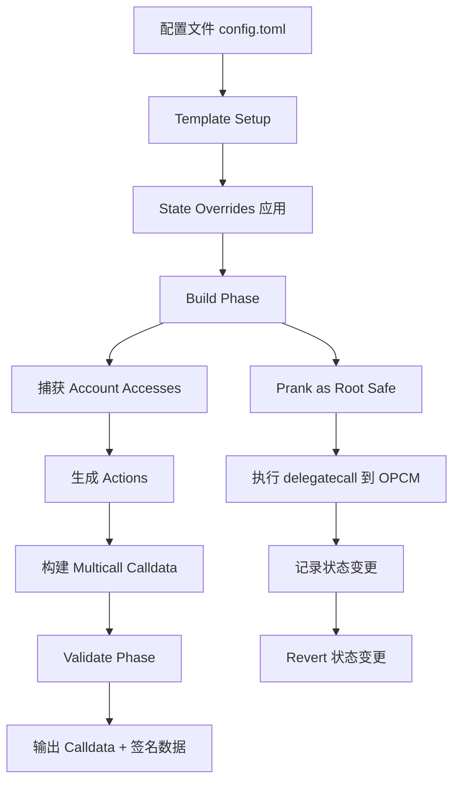

# Superchain-Ops 合约升级流程详解

## 概述

`superchain-ops` 是一个基于 **Foundry** 和 **Gnosis Safe** 的多签任务管理系统，专门用于管理 Optimism Superchain 的链上操作（包括合约升级）。与 `op-deployer` 不同，`superchain-ops` 提供了更完善的**多签工作流**、**状态验证**和**嵌套 Safe 支持**。

## 核心架构

### 1. 模板系统 (Template System)

`superchain-ops` 使用**模板合约**来定义不同类型的任务。对于 OPCM 升级，使用 `OPCMUpgradeV500` 模板：

```solidity:superchain-ops/src/template/OPCMUpgradeV500.sol
contract OPCMUpgradeV500 is OPCMTaskBase {
    // 定义升级配置
    struct OPCMUpgrade {
        Claim absolutePrestate;
        uint256 chainId;
        string expectedValidationErrors;
    }
    
    // 核心执行逻辑
    function _build(address) internal override {
        // 1. 升级 SuperchainConfig（如果需要）
        // 2. 构建 OpChainConfig[] 数组
        // 3. delegatecall 到 OPCM.upgrade()
    }
}
```

### 2. 任务执行流程



## 详细执行流程

### 阶段 1: 配置加载 (`_templateSetup`)

**位置**: `OPCMUpgradeV500._templateSetup()`

```solidity
function _templateSetup(string memory taskConfigFilePath, address rootSafe) internal override {
    // 1. 读取 TOML 配置文件
    string memory tomlContent = vm.readFile(taskConfigFilePath);
    
    // 2. 从地址注册表获取 SuperchainConfig
    SUPERCHAIN_CONFIG = ISuperchainConfig(
        superchainAddrRegistry.getAddress("SuperchainConfig", anyChainId)
    );
    
    // 3. 通过 EIP-1967 获取 ProxyAdmin
    address scAdmin = EIP1967Helper.getAdmin(address(SUPERCHAIN_CONFIG));
    SUPERCHAIN_CONFIG_PROXY_ADMIN = IProxyAdmin(scAdmin);
    
    // 4. 解析升级配置
    OPCMUpgrade[] memory _upgrades = abi.decode(
        tomlContent.parseRaw(".opcmUpgrades"), 
        (OPCMUpgrade[])
    );
    
    // 5. 验证 OPCM 版本
    OPCM = tomlContent.readAddress(".addresses.OPCM");
    require(IOPContractsManager(OPCM).version().eq("4.2.0"), "Incorrect OPCM");
}
```

**配置文件示例** (`config.toml`):
```toml
l2chains = [
    {name = "OP Mainnet", chainId = 10},
    {name = "Ink", chainId = 57073}
]

templateName = "OPCMUpgradeV500"

[[opcmUpgrades]]
chainId = 10
absolutePrestate = "0x03caa1871bb9fe7f9b11217c245c16e4ded33367df5b3ccb2c6d0a847a217d1b"
expectedValidationErrors = "OVERRIDES-L1PAOMULTISIG,OVERRIDES-CHALLENGER"

[addresses]
OPCM = "0xfa1ef97fb02b0da2ee2346b8e310907ab5519449"

[stateOverrides]
# 设置 Safe nonces
0x5a0Aae59D09fccBdDb6C6CcEB07B7279367C3d2A = [
    {key = "0x5", value = 28}  # nonce slot
]
```

### 阶段 2: 状态覆盖 (State Overrides)

**位置**: `MultisigTask._overrideState()`

在模拟执行前，系统会应用状态覆盖（State Overrides），主要用于：
- 设置 Safe nonces（模拟多签已批准的状态）
- 覆盖其他链上状态（如果需要）

```solidity
function _overrideState(string memory _taskConfigFilePath, address[] memory _allSafes) 
    private returns (uint256[] memory allOriginalNonces_) 
{
    // 1. 从配置读取状态覆盖
    _setStateOverridesFromConfig(_taskConfigFilePath);
    
    // 2. 记录原始 nonces
    for (uint256 i = 0; i < _allSafes.length; i++) {
        allOriginalNonces_[i] = _getNonceOrOverride(_allSafes[i], _taskConfigFilePath);
    }
    
    // 3. 应用状态覆盖
    _applyStateOverrides();
}
```

### 阶段 3: 构建阶段 (Build Phase)

**位置**: `OPCMUpgradeV500._build()`

这是**核心执行逻辑**，但所有状态变更都会被**回滚**：

```solidity
function _build(address) internal override {
    // 1. 升级 SuperchainConfig（如果需要）
    string memory current = SUPERCHAIN_CONFIG.version();
    address targetImpl = IOPContractsManager(OPCM_TARGETS[0])
        .implementations().superchainConfigImpl;
    string memory target = ISuperchainConfig(targetImpl).version();
    
    if (keccak256(bytes(current)) != keccak256(bytes(target))) {
        // delegatecall 到 OPCM.upgradeSuperchainConfig()
        OPCM_TARGETS[0].delegatecall(
            abi.encodeCall(
                IOPContractManagerV500.upgradeSuperchainConfig,
                (SUPERCHAIN_CONFIG, SUPERCHAIN_CONFIG_PROXY_ADMIN)
            )
        );
    }
    
    // 2. 构建 OpChainConfig[] 数组
    SuperchainAddressRegistry.ChainInfo[] memory chains = 
        superchainAddrRegistry.getChains();
    IOPContractsManager.OpChainConfig[] memory opChainConfigs =
        new IOPContractsManager.OpChainConfig[](chains.length);
    
    for (uint256 i = 0; i < chains.length; i++) {
        uint256 chainId = chains[i].chainId;
        opChainConfigs[i] = IOPContractsManager.OpChainConfig({
            systemConfigProxy: ISystemConfig(
                superchainAddrRegistry.getAddress("SystemConfigProxy", chainId)
            ),
            proxyAdmin: IProxyAdmin(
                superchainAddrRegistry.getAddress("ProxyAdmin", chainId)
            ),
            absolutePrestate: upgrades[chainId].absolutePrestate
        });
    }
    
    // 3. delegatecall 到 OPCM.upgrade()
    OPCM_TARGETS[0].delegatecall(
        abi.encodeWithSelector(
            IOPContractsManager.upgrade.selector, 
            opChainConfigs
        )
    );
}
```

**关键点**:
- `vm.startPrank(rootSafe, true)` - 以 Root Safe 身份执行，`true` 表示启用 `delegatecall` 模式
- `vm.startStateDiffRecording()` - 开始记录所有状态变更
- 所有调用都通过 `delegatecall` 执行（因为 OPCM 必须在 Safe 的上下文中运行）

### 阶段 4: 动作提取 (Action Extraction)

**位置**: `MultisigTask._endBuild()`

系统会分析 `AccountAccess` 记录，提取出**顶层调用**（Top-level calls）：

```solidity
function _endBuild(address rootSafe) private returns (Action[] memory) {
    // 1. 停止状态记录
    VmSafe.AccountAccess[] memory accesses = vm.stopAndReturnStateDiff();
    
    // 2. 回滚所有状态变更
    vm.revertToState(_preExecutionSnapshot);
    
    // 3. 提取有效的 Actions
    uint256 topLevelDepth = accesses[0].depth;
    for (uint256 i = 0; i < accesses.length; i++) {
        if (_isValidAction(accesses[i], topLevelDepth, rootSafe)) {
            // 这是一个有效的 Action（顶层 delegatecall 到 OPCM）
            tempActions[validCount] = Action({
                target: accesses[i].account,  // OPCM 地址
                arguments: accesses[i].data,   // calldata
                operation: Enum.Operation.DelegateCall
            });
        }
    }
    
    return validActions;
}
```

**过滤规则** (`_isValidAction`):
- 必须是顶层调用（`depth == topLevelDepth`）
- 必须是 `DelegateCall` 或 `Call`
- 调用者必须是 Root Safe
- 目标不能是地址注册表或 VM

### 阶段 5: Calldata 生成

**位置**: `OPCMTaskBase._getMulticall3Calldata()`

由于 OPCM 任务使用 `Multicall3DelegateCall`，calldata 格式如下：

```solidity
function _getMulticall3Calldata(Action[] memory actions) 
    internal pure override returns (bytes memory data) 
{
    (address[] memory targets, , bytes[] memory arguments) = 
        processTaskActions(actions);
    
    IMulticall3.Call3[] memory calls = new IMulticall3.Call3[](targets.length);
    for (uint256 i; i < calls.length; i++) {
        calls[i] = IMulticall3.Call3({
            target: targets[i],        // OPCM 地址
            allowFailure: false,
            callData: arguments[i]     // OPCM.upgrade(...) 的 calldata
        });
    }
    
    // 生成 Multicall3DelegateCall.aggregate3() 的 calldata
    data = abi.encodeCall(IMulticall3.aggregate3, (calls));
}
```

**最终 Calldata 结构**:
```
Multicall3DelegateCall.aggregate3([
    Call3(
        target: OPCM_ADDRESS,
        allowFailure: false,
        callData: OPCM.upgrade(OpChainConfig[])
    )
])
```

### 阶段 6: 验证阶段 (Validation)

**位置**: `OPCMUpgradeV500._validate()`

执行后验证：

```solidity
function _validate(...) internal view override {
    // 1. 验证 SuperchainConfig 已升级
    require(
        EIP1967Helper.getImplementation(address(SUPERCHAIN_CONFIG))
            == IOPContractsManager(OPCM_TARGETS[0])
                .implementations().superchainConfigImpl,
        "Incorrect SuperchainConfig implementation"
    );
    
    // 2. 验证版本号
    require(
        SUPERCHAIN_CONFIG.version().eq("2.4.0"),
        "Incorrect SuperchainConfig version"
    );
    
    // 3. 使用 Standard Validator 验证每个链
    for (uint256 i = 0; i < chains.length; i++) {
        string memory errors = STANDARD_VALIDATOR.validateWithOverrides(
            input, true, overrides
        );
        require(
            errors.eq(upgrades[chainId].expectedValidationErrors),
            "Unexpected validation errors"
        );
    }
}
```

## 如何使用

### 1. 模拟执行 (Simulation)

```bash
cd src/tasks/eth/032-U17-main-op-sony-ink

# 不使用 Ledger（使用 Safe 的第一个 owner）
SIMULATE_WITHOUT_LEDGER=1 just --dotenv-path $(pwd)/.env simulate

# 指定子 Safe（如果有嵌套结构）
SIMULATE_WITHOUT_LEDGER=1 just --dotenv-path $(pwd)/.env simulate foundation

# 使用 Ledger
just --dotenv-path $(pwd)/.env simulate
```

**执行过程**:
1. Fork 主网（通过 `ETH_RPC_URL`）
2. 应用状态覆盖（State Overrides）
3. 执行 `simulate()` 函数
4. 输出：
   - Calldata（用于执行）
   - 状态变更摘要
   - Tenderly 模拟链接
   - 签名数据（EIP-712）

### 2. 签名 (Signing)

```bash
# 使用 Ledger
just sign

# 使用 Keystore
USE_KEYSTORE=1 just sign

# 指定 HD 路径
HD_PATH=1 just sign
```

**输出**: EIP-712 签名的交易哈希

### 3. 执行 (Execute)

```bash
# 设置签名（多个签名者用逗号分隔）
export SIGNATURES="0x<sig1>,0x<sig2>,..."

# 执行
just execute
```

## OPCM 执行路径

当 Calldata 在主网执行时，调用链如下：

```
Root Safe (ProxyAdminOwner)
  └─> Multicall3DelegateCall.aggregate3([...])
        └─> delegatecall OPCM.upgrade(OpChainConfig[])
              └─> OPCM._doChainUpgrade()
                    ├─> upgradeTo(SystemConfig)
                    ├─> upgradeTo(OptimismPortal)
                    ├─> upgradeTo(L1CrossDomainMessenger)
                    └─> ... (其他合约)
```

**关键点**:
- 所有调用都是 `delegatecall`，因此执行上下文是 Root Safe
- OPCM 通过 `ProxyAdmin.upgrade()` 来升级各个代理合约
- Root Safe 必须是所有链的 `ProxyAdmin` 的 Owner

## 与 op-deployer 的对比

| 特性 | op-deployer | superchain-ops |
|------|-------------|----------------|
| **多签支持** | ❌ 需要手动处理 | ✅ 完整支持 |
| **嵌套 Safe** | ❌ | ✅ |
| **状态验证** | 基础 | ✅ 完整验证框架 |
| **Calldata 生成** | ✅ | ✅ |
| **签名管理** | 手动 | ✅ 集成 EIP-712 |
| **配置格式** | JSON | TOML |
| **模板系统** | ❌ | ✅ 可复用模板 |

## 本地模拟主网升级

### 方法 1: 使用 superchain-ops（推荐）

```bash
# 1. Fork 主网
export ETH_RPC_URL="https://eth-mainnet.g.alchemy.com/v2/YOUR_KEY"

# 2. 设置 fork block（可选）
export FORK_BLOCK_NUMBER=21000000

# 3. 模拟
cd src/tasks/eth/032-U17-main-op-sony-ink
SIMULATE_WITHOUT_LEDGER=1 just --dotenv-path $(pwd)/.env simulate
```

### 方法 2: 手动 Fork 测试

```solidity
// TestUpgrade.s.sol
pragma solidity ^0.8.15;

import "forge-std/Script.sol";
import {OPCMUpgradeV500} from "src/template/OPCMUpgradeV500.sol";

contract TestUpgrade is Script {
    function run() public {
        vm.createSelectFork(vm.envString("ETH_RPC_URL"));
        
        OPCMUpgradeV500 task = new OPCMUpgradeV500();
        
        // 模拟执行
        (VmSafe.AccountAccess[] memory accesses, , bytes memory calldata) = 
            task.simulate("config.toml");
        
        // 验证状态变更
        // ...
    }
}
```

## 总结

`superchain-ops` 提供了一个**企业级的多签任务管理系统**，特别适合需要：
- 多签审批流程
- 状态验证和审计
- 嵌套 Safe 架构
- 可复用的任务模板

对于简单的单链升级，`op-deployer` 可能更直接；但对于复杂的多链、多签升级场景，`superchain-ops` 提供了更完善的工具链。

