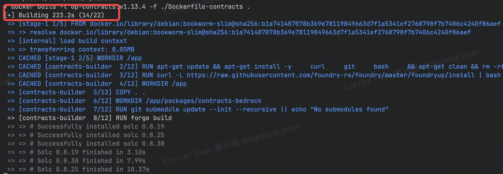
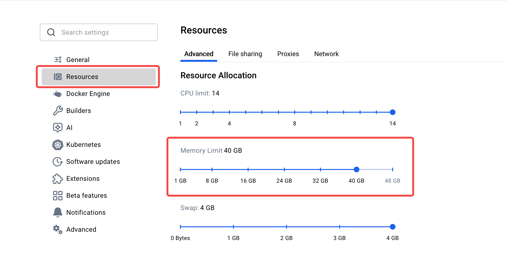

# Optimism Test Environment Setup Guide

## Quick Start

### One-Click Deployment
Run `./0-all.sh` to automatically:
- Initialize the environment
- Start all required components
- Complete all configurations and deployments

> Note: For first-time setup, we recommend following the step-by-step deployment process to better understand each component and troubleshoot any potential issues.

### Step-by-Step Deployment
For more granular control or troubleshooting, follow the steps below.

## Prerequisites

### System Requirements
- Docker 20.10.0 or higher
- Docker Compose
- At least 32GB RAM
- At least 32GB available disk space

if you stuck here, please give docker engine more memory limit, better to over 32GB




### Initial Setup (First Time Only)
1. Run `./init.sh` to initialize the environment (only needed once):
   - Install all git submodules
   - Build required Docker images
   - Prepare base environment

> Important: `init.sh` should only be run once during initial setup. Re-run only if you need to rebuild Docker images after code changes.

### Directory Structure
```
test/
├── 0-all.sh            # One-click deployment script
├── init.sh             # Initialization script
├── clean.sh            # Environment cleanup script
├── 1-start-l1.sh       # L1 chain startup script
├── 2-deploy-op-contracts.sh  # Contract deployment script
├── 3-op-init.sh        # Environment initialization script
├── 4-op-start-service.sh    # Service startup script
├── config-op/          # Configuration directory
├── data/              # Data storage directory
└── .env               # Environment variables
```

## Deployment Process

### 1. L1 Environment Setup
Run `./1-start-l1.sh`:
- Starts a complete PoS L1 test chain (EL + CL)
- CL node handles blob data storage
- Automatically funds test accounts:
  - Batcher
  - Proposer
  - Challenger

### 2. Smart Contract Deployment
Run `./2-deploy-op-contracts.sh`:
- Deploys Transactor contract
- Deploys and initializes all Optimism L1 contracts
- Generates configuration files:
  - `rollup.json`: op-node configuration
  - `genesis.json`: L2 initial state

### 3. Environment Initialization
Run `./3-op-init.sh`:
- Initializes op-geth database
  - Sequencer node
  - RPC node
- Generates dispute game components:
  - Compiles op-program
  - Generates prestate files
  - Creates state proofs

### 4. Service Startup
Run `./4-op-start-service.sh`:
- Launches core services:
  - op-batcher: L2 transaction batch processing
  - op-proposer: L2 state submission
  - op-node: State sync and validation
  - op-geth: L2 execution engine
  - op-challenger: State validation
  - op-dispute-mon: Dispute monitoring
  - op-conductor: Sequencer HA management

### 5. Conductor Management
The test environment includes a 3-node conductor cluster for sequencer high availability (HA).

#### Architecture
- **Cluster Type**: 3-node Raft consensus cluster
- **Active Sequencer**: Only runs on leader node
- **Failover**: Automatic when leader becomes unhealthy
- **High Availability**: Ensures continuous L2 block production

#### Configuration
Enable or disable conductor cluster in `.env`:
```bash
# Enable HA mode with conductor cluster
CONDUCTOR_ENABLED=true

# Disable HA, run single sequencer
CONDUCTOR_ENABLED=false
```

#### Network Ports
Each conductor node uses three ports:
- **RPC Port**: Management API
  - Node 1: 8547
  - Node 2: 8548
  - Node 3: 8549

- **Consensus Port**: Raft protocol
  - Node 1: 50050
  - Node 2: 50051
  - Node 3: 50052

- **Sequencer Port**: L2 execution
  - Node 1: 9545
  - Node 2: 9546
  - Node 3: 9547

#### Health Monitoring
The conductor cluster monitors each node's:
- Sync status with L1
- P2P network connectivity
- Block production rate

When leader becomes unhealthy:
- Automatically transfers leadership
- Deactivates unhealthy sequencer
- Activates sequencer on new leader

#### Leadership Management
Control cluster leadership with `transfer_leader.sh`:
```bash
# Auto transfer to any healthy node
./scripts/transfer_leader.sh

# Transfer to specific node (1-3)
./scripts/transfer_leader.sh 2
```

## Troubleshooting

### Common Issues
1. Service Startup Failures
   - Check Docker logs: `docker compose logs <service-name>`
   - Verify port availability
   - Validate environment variables

2. Contract Deployment Issues
   - Verify L1 node is running
   - Check account balances
   - Validate gas settings

### Environment Reset
To reset the environment:
- Run `./clean.sh`: automatically stops all services and cleans up
- Script handles:
  - Stopping all Docker containers
  - Cleaning data directory
  - Resetting environment to initial state from example.env
