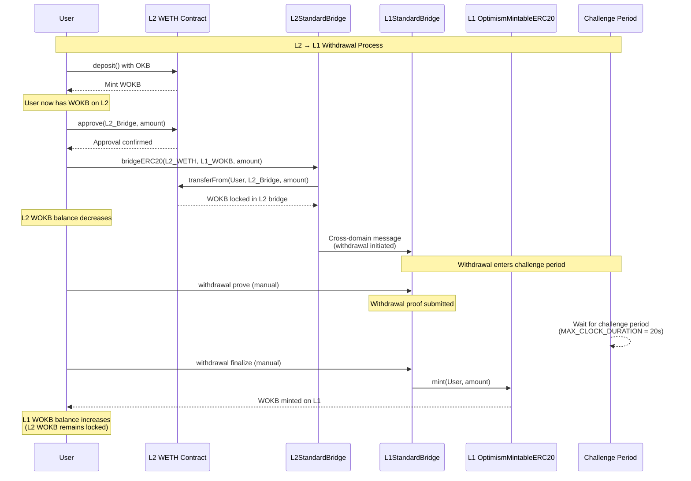
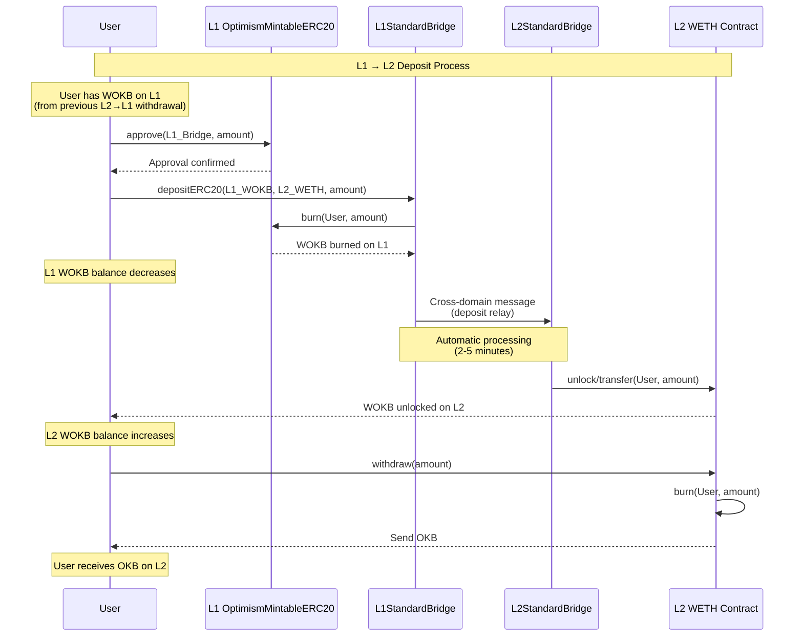

# CGT Cross-Chain Sequence Diagrams

## L2 → L1 Withdrawal Sequence

## L1 → L2 Deposit Sequence

## Key Concepts

### Token Mechanics

#### L2 → L1 Withdrawal (Lock/Mint) - CGT Mode
- **L2**: WOKB tokens are **locked** in L2StandardBridge (WETH is native contract)
- **L1**: WOKB tokens are **minted** on L1 OptimismMintableERC20 (after challenge period)
- **Security**: Challenge period allows dispute of invalid withdrawals

#### L1 → L2 Deposit (Burn/Unlock) - CGT Mode
- **L1**: WOKB tokens are **burned** on L1 OptimismMintableERC20 contract
- **L2**: Previously locked WOKB tokens are **unlocked** from L2StandardBridge
- **Speed**: No challenge period needed, faster processing

### Timing
- **L2 → L1**: Manual prove/finalize steps + challenge period (20s in test)
- **L1 → L2**: Automatic processing (2-5 minutes)
- **Challenge Period**: Configurable via `MAX_CLOCK_DURATION`

### Test Design
- **Part 1**: Complete L2→L1 withdrawal flow (includes prove/finalize)
- **Part 2**: Independent L1→L2 deposit testing
- **Verification**: Real-time balance checking at each step
