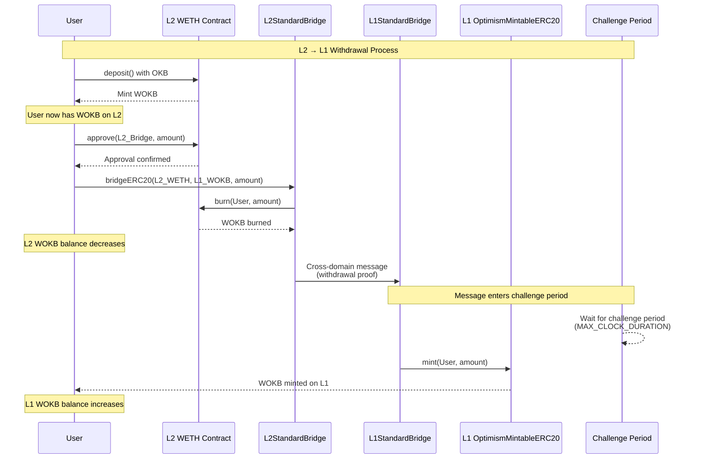
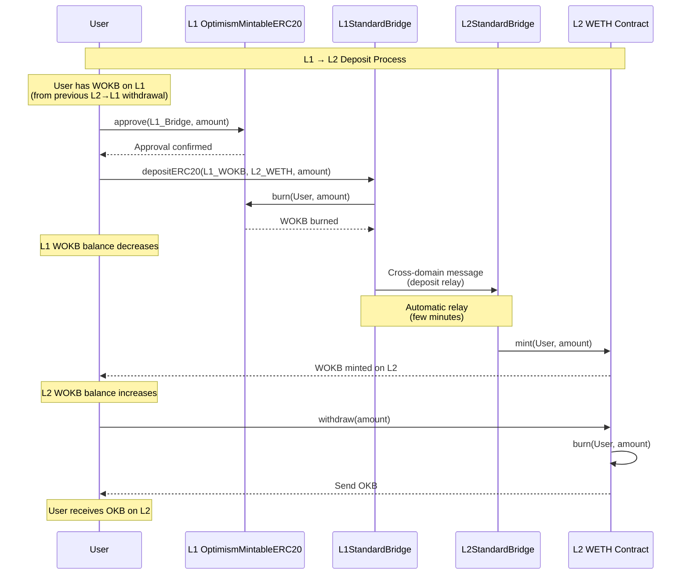
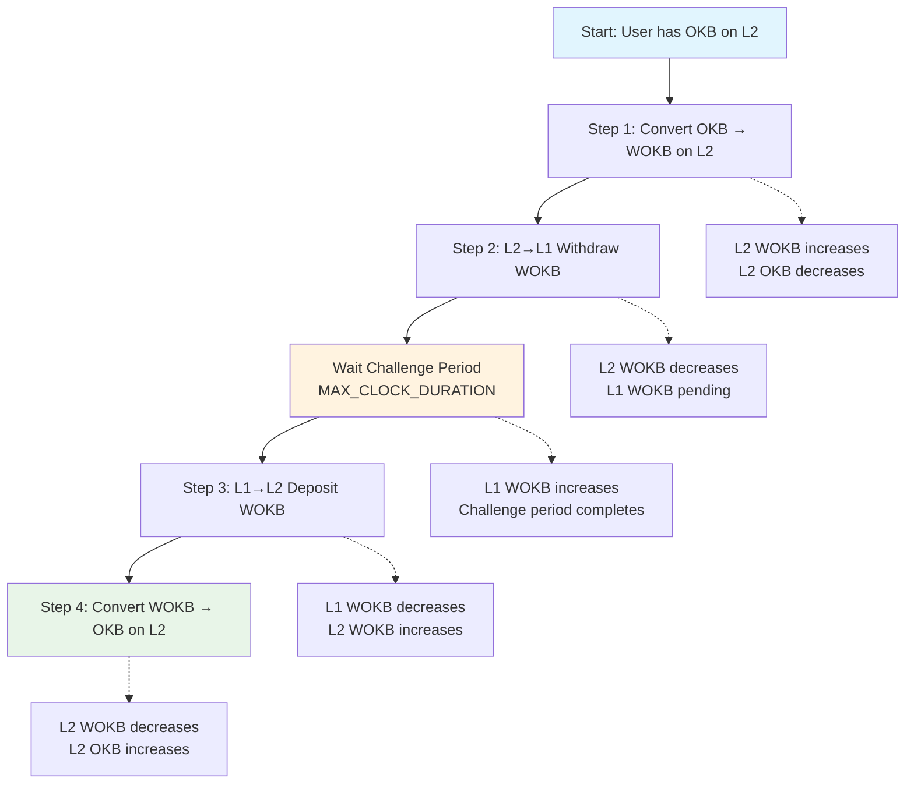

# CGT Cross-Chain Sequence Diagrams

## L2 → L1 Withdrawal Sequence

## L1 → L2 Deposit Sequence

## Complete Test Flow

## Key Concepts

- **L2 → L1**: Withdrawal with challenge period for security
- **L1 → L2**: Deposit with automatic relay for speed
- **Challenge Period**: Configurable via `MAX_CLOCK_DURATION`
- **Test Split**: Avoid waiting during automated testing
